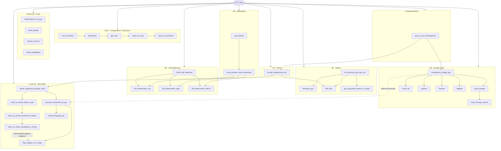

# GCP Index (Mapa maestro)
> **Objetivo**: Punto de entrada a todas las notas de GCP. Organizado por los 7 módulos del curso *Google Cloud Fundamentals: Core Infrastructure*, más notas complementarias de contexto profesional. Mantiene enlaces bidireccionales para potenciar el grafo de Obsidian.

---

## 🗂️ Estructura del curso (7 módulos)

| Módulo | Tema | Notas |
|--------|------|-------|
| 1 | Introducción a GCP y cloud computing | [[herarquia_gcp]], [[IAM_intro]], [[gcp_seguridad_disenio_en_capas]] |
| 2 | Jerarquía de recursos e IAM | [[00_proyectos_gcp_que_son]], [[IAM_intro]], [[interactuando_con_gcp]] |
| 3 | Compute Engine, VPC y Load Balancing | [[gcp-network]], [[virtual_private_cloud_networking]], [[cloud_load_balancing]] |
| 4 | Almacenamiento y bases de datos | [[cloud_storage]], [[cloud_sql]], [[spanner]], [[firestore]], [[bigtable]] |
| 5 | Contenedores y Kubernetes | [[intro_containers]], [[kubernetes_intro]], [[gke_intro]] |
| 6 | Desarrollo de apps en la nube | [[cloud_run_intro]], [[cloud_run_functions]] |
| 7 | GenAI y Prompt Engineering | [[prompt_engineering_intro]] |

---

## 📚 Módulo 1 · Núcleo conceptual
- Jerarquía de recursos → [[herarquia_gcp]]
- Proyectos → [[00_proyectos_gcp_que_son]]
- Identidad y Acceso (IAM) → [[IAM_intro]]
- Seguridad en capas (infra + operaciones) → [[gcp_seguridad_disenio_en_capas]]

## 🌐 Módulo 3 · Networking
- Estructura geográfica y zonas → [[gcp-network]]
- VPC Networking → [[virtual_private_cloud_networking]]

## 🔀 Módulo 3 · Load Balancing
- Visión general → [[cloud_load_balancing]]
- L4 (Network LB) → [[002_balanceador_red]]
- L7 (Application LB) → [[003_balanceador_apps]]
- L7 Interno (Internal ALB) → [[004_balanceador_interno]]

## 🗄️ Módulo 4 · Storage y Bases de datos
- Cloud Storage (objeto) → [[cloud_storage]]
- Clases de almacenamiento → [[cloud_storage_classes]]
- Cloud SQL (relacional gestionado) → [[cloud_sql]]
- Spanner (relacional distribuido) → [[spanner]]
- Firestore (NoSQL documentos) → [[firestore]]
- Bigtable (NoSQL big data) → [[bigtable]]
- Comparativa de opciones → [[comparativa_storage_gcp]]

## 📦 Módulos 5-6 · Contenedores y cómputo serverless
- Introducción a contenedores → [[intro_containers]]
- Kubernetes (orquestación) → [[kubernetes_intro]]
- Google Kubernetes Engine (GKE) → [[gke_intro]]
- Cloud Run (contenedores serverless) → [[cloud_run_intro]]
- Cloud Run Functions (FaaS event-driven) → [[cloud_run_functions]]

## 🤖 Módulo 7 · GenAI y Prompt Engineering
- Fundamentos y buenas prácticas → [[prompt_engineering_intro]]

## 🧠 Curso 04 · Introduction to AI and ML on Google Cloud
> Curso independiente de la ruta *Getting started with Google Cloud*, **completado el 25/08/2026**. Continúa y aplica los conceptos de [[prompt_engineering_intro]] dentro de la arquitectura de GenAI de Google.
- Arquitectura de GenAI en Google Cloud (3 capas: foundation models, dev, apps) → [[genai_arquitectura_google_cloud]]
- Vertex AI Studio: de la idea a la app (anatomía de un prompt, caso Cymbal Insurance) → [[vertex_ai_studio_idea_to_app]]
- Vertex AI Studio: parámetros del modelo y evaluación (temperature, Top K, Top P) → [[vertex_ai_studio_parametros_modelo]]
- Vertex AI Studio: despliegue, grounding/RAG y tuning de modelos (prompt design, adapter tuning, full fine-tuning) → [[vertex_ai_studio_despliegue_y_tuning]]
- Opciones de desarrollo de ML (APIs preentrenadas · BigQuery ML · AutoML · entrenamiento personalizado) → [[opciones_desarrollo_ml_gcp]]
- Cloud Natural Language API (entidades, sentimiento, sintaxis, categorías) → [[natural_language_api]]
- Flujo de trabajo de ML y MLOps (3 etapas, métricas, Vertex AI Pipelines) → [[flujo_trabajo_ml_y_mlops]]

## 🧰 Interacción y herramientas (transversal)
- Formas de interactuar con GCP → [[interactuando_con_gcp]]
- Cloud Identity → [[cloud_identity]]
- Cuentas de servicio → [[cuentas_servicio]]
- Cloud Marketplace → [[cloud_marketplace]]

## 🌍 Notas complementarias (fuera del curso)
- Homologación GCP ↔ AWS → [[gcp_vs_aws_homologacion]]

---

## 🗺️ Visión general (Mermaid)

> Si el diagrama no renderiza, verifica que **no** haya saltos de línea dentro de etiquetas y que Mermaid esté habilitado en Obsidian.

---

## ➕ Cómo seguir alimentando este índice
1. Crea nuevas notas con `tags: [GCP]`.
2. Enlaza desde la nota hacia los conceptos madre según el módulo correspondiente.
3. Añade la nueva nota en la sección correcta de este índice y al diagrama Mermaid.
4. Usa aliases `[[nota|Alias bonito]]` para mejorar la lectura sin romper enlaces.
5. Si la nota es externa al curso (comparativas, decisiones arquitecturales), agrégala en **Notas complementarias**.

---

## 📥 Changelog
- **v0.9 (2026-08-25)**: Se agrega `flujo_trabajo_ml_y_mlops` (las tres etapas del flujo de ML, Feature Store, matriz de confusión con precisión/recuperación, Explainable AI, las tres formas de servir predicciones, y MLOps con Vertex AI Pipelines, componentes y fases de adopción). **Curso 04 completado.**
- **v0.8 (2026-08-24)**: Se agregan `opciones_desarrollo_ml_gcp` (tabla comparativa y mapa de decisión entre APIs preentrenadas, BigQuery ML, AutoML y entrenamiento personalizado, con Vertex AI como plataforma unificada) y `natural_language_api` (entidades, sentimiento, sintaxis y categorías), cubriendo la rama **predictiva** del Curso 04 frente a la generativa ya documentada.
- **v0.7 (2026-07-29)**: Se agrega `vertex_ai_studio_despliegue_y_tuning` (despliegue vía SDK/API, grounding/RAG y tuning de modelos: prompt design, parameter-efficient tuning, full fine-tuning) como cierre del ciclo prompt-to-production del Curso 04, enlazada como continuación de `vertex_ai_studio_parametros_modelo`.
- **v0.6 (2026-07-27)**: Se agrega la sección **Curso 04 · Introduction to AI and ML on Google Cloud** (en progreso) con las notas `genai_arquitectura_google_cloud`, `vertex_ai_studio_idea_to_app` y `vertex_ai_studio_parametros_modelo`, enlazadas como continuación de `prompt_engineering_intro`. Se crean `CLAUDE.md`, `README.md` y la skill `gcp-feynman-note` que estandariza la creación de notas y la actualización de este índice.
- **v0.5 (2026-03-03)**: Curso completado. Se agrega **M7 · GenAI y Prompt Engineering** con `prompt_engineering_intro`. Se añade la sección **Notas complementarias** con `gcp_vs_aws_homologacion`. Se incorpora la tabla resumen de los 7 módulos del curso y se reorganiza el objetivo del índice.
- **v0.4 (2026-03-03)**: Se agrega la sección **Contenedores y cómputo serverless** con `intro_containers`, `kubernetes`, `gke_intro`, `cloud_run_intro` y `cloud_run_functions`.
- **v0.3 (2026-02-24)**: Se agrega la sección **Storage y Bases de datos** con `cloud_storage`, `cloud_storage_classes`, `cloud_sql`, `spanner`, `firestore`, `bigtable` y `comparativa_storage_gcp`.
- **v0.2 (2026-02-16)**: Se agregan **VPC**, **Cloud Marketplace** y el cluster de Load Balancing completo (L4/L7/Interno).
- **v0.1**: Índice inicial con Jerarquía, IAM, Seguridad, Networking básico e Interacción.
