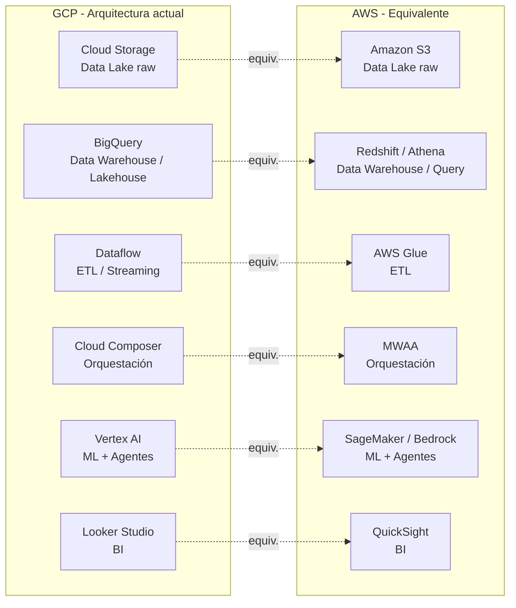

# Homologación GCP ↔ AWS: Guía para equipos de datos y analítica
> **Resumen en una frase:** Esta nota mapea los servicios equivalentes entre GCP y AWS con foco en analítica, data engineering, ML y agentes de IA, para facilitar la evaluación de arquitecturas multi-cloud o la decisión de migración.

> ⚠️ **Contexto de uso:** La empresa tiene un **lakehouse en GCP**, está migrando el warehouse, ejecuta modelos analíticos y primeros agentes de IA en GCP, y tiene un equipo de IA que desarrolla agentes en AWS (Bedrock). El equipo de analítica está evaluando si vale la pena moverse a AWS.

---

## 1) Analogía sencilla (Feynman)
Imagina que GCP y AWS son dos ciudades con los mismos barrios (cómputo, almacenamiento, bases de datos, IA), pero con **nombres de calles distintos** y **personalidades diferentes**:

- **GCP** es una ciudad diseñada por ingenieros de datos: sus avenidas principales son **BigQuery y Vertex AI**. Todo el transporte converge ahí.
- **AWS** es una ciudad construida por constructores generalistas: tiene **más calles** (más servicios), más barrios (regiones), y más opciones para cada destino, pero navegar puede ser más complejo.

Si ya vives en GCP y te especializas en datos y analytics, cambiar de ciudad tiene un costo real de reubicación.

---

## 2) Tabla de homologación general

| Categoría | GCP | AWS | Notas clave |
|-----------|-----|-----|-------------|
| **Cómputo (VMs)** | Compute Engine | EC2 | AWS ofrece más tipos de instancia; GCP permite combinar vCPU/RAM a la carta |
| **Kubernetes gestionado** | GKE | EKS | GKE es el origen de Kubernetes; EKS es robusto pero más complejo de operar |
| **Contenedores serverless** | Cloud Run | AWS Fargate / App Runner | Cloud Run escala a cero nativo; Fargate requiere más configuración |
| **Funciones serverless (FaaS)** | Cloud Run Functions | AWS Lambda | Lambda es más maduro y con más integraciones nativas; ambos cobran por 100ms |
| **Object Storage** | Cloud Storage | Amazon S3 | Equivalentes en funcionalidad; S3 tiene mayor ecosistema de herramientas third-party |
| **Data Warehouse** | BigQuery | Amazon Redshift | Ver sección 4 — diferencia significativa |
| **Data Lake query** | BigQuery / BigLake | Amazon Athena | Athena consulta S3 directamente con SQL; BigQuery es más integrado |
| **ETL / Pipelines batch** | Cloud Dataflow (Apache Beam) | AWS Glue | Dataflow es más potente; Glue es más fácil de configurar visualmente |
| **Orquestación de pipelines** | Cloud Composer (Airflow) | Amazon MWAA (Airflow) | Ambos son Airflow gestionado; diferencia está en madurez y costo |
| **Streaming** | Pub/Sub + Dataflow | Kinesis + Glue / Lambda | Pub/Sub es más simple; Kinesis ofrece más control sobre particiones |
| **Base relacional gestionada** | Cloud SQL | Amazon RDS | Equivalentes; RDS tiene más engines disponibles |
| **Base relacional distribuida** | Spanner | Amazon Aurora | Spanner es más consistente globalmente; Aurora es más maduro en el ecosistema AWS |
| **NoSQL documentos** | Firestore | Amazon DynamoDB | DynamoDB es más maduro y con menor latencia; Firestore es más amigable |
| **NoSQL big data** | Bigtable | Amazon DynamoDB (alt.) / Keyspaces | No hay equivalente exacto en AWS; Keyspaces (Cassandra) es el más cercano |
| **ML / MLOps** | Vertex AI | Amazon SageMaker | Ver sección 5 — diferencia significativa |
| **Agentes de IA / GenAI** | Vertex AI Agent Builder | Amazon Bedrock Agents | Ver sección 6 — el más relevante para tu contexto |
| **BI / Visualización** | Looker Studio / Looker | Amazon QuickSight | Looker tiene más profundidad analítica; QuickSight está mejor integrado en AWS |
| **IAM** | Cloud IAM | AWS IAM | Conceptualmente similares; GCP tiene herencia de permisos más limpia |
| **Red privada** | VPC (global por defecto) | VPC (regional) | La VPC de GCP es global; en AWS cada región tiene su propia VPC |
| **Observabilidad** | Cloud Monitoring + Logging | CloudWatch | CloudWatch requiere más configuración; GCP Observability es más integrado con GKE |

---

## 3) Mapa de equivalencias: arquitectura lakehouse

---

## 4) Diferencia crítica: BigQuery vs. Redshift

Esta es la diferencia más importante para un equipo de analítica.

| Aspecto | BigQuery (GCP) | Redshift (AWS) |
|---------|---------------|----------------|
| Modelo | **Serverless** total | Clúster (o serverless con límites) |
| Gestión | Sin operaciones (vacuuming, tunning) | Requiere mantenimiento activo |
| Escalado | Automático e instantáneo | Manual o con fricciones |
| Integración ML | BigQuery ML (SQL directo) | Requiere SageMaker externo |
| Integración BI | Nativa con Looker, Looker Studio | Nativa con QuickSight |
| Estimación de costo antes de correr query | ✅ Sí, en la UI | ❌ No |
| Costo modelo | Por TB escaneado (on-demand) o slots | Por nodos/RPUs |
| Curva de aprendizaje | Baja | Media-alta |

**Conclusión práctica:** Si tu equipo ya usa BigQuery como núcleo del lakehouse, mover esa capa a Redshift implica un costo operativo real: más configuración, más mantenimiento, menos integración nativa con ML y BI. **BigQuery no tiene un equivalente exacto en AWS.**

---

## 5) Diferencia relevante: Vertex AI vs. SageMaker

| Aspecto | Vertex AI (GCP) | SageMaker (AWS) |
|---------|----------------|-----------------|
| Integración con data warehouse | **Directa con BigQuery** (SQL → modelo) | Requiere conectores a Redshift/S3 |
| AutoML | Sí, integrado | Sí (SageMaker Autopilot) |
| Fine-tuning de LLMs | Gemini + modelos OSS | Claude (Bedrock), Llama, Titan |
| MLOps / Pipelines | Vertex Pipelines (Kubeflow) | SageMaker Pipelines |
| Curva de aprendizaje | Media (más integrado, menos opciones) | Media-alta (más opciones, más complejo) |
| Fortaleza diferencial | **Data-centric ML** (BQ + Vertex) | **Control granular** de infraestructura ML |

---

## 6) El más relevante para tu contexto: Vertex AI Agents vs. AWS Bedrock Agents

Aquí está la tensión real de tu empresa: **equipo GCP-first con agentes en GCP** vs. **equipo de IA con agentes en AWS Bedrock**.

| Aspecto | Vertex AI Agent Builder | AWS Bedrock Agents |
|---------|------------------------|-------------------|
| Modelos disponibles | Gemini (nativo) + OSS via Model Garden | Claude (Anthropic), Llama, Titan, Cohere, Mistral y más |
| Flexibilidad de modelos | Menor (más cerrado al ecosistema Google) | **Mayor** — multi-vendor por diseño |
| Integración con datos propios | Directa con BigQuery y Cloud Storage | RAG sobre S3 + Knowledge Bases |
| Integración con otros servicios | GCP-native (Pub/Sub, Dataflow, Cloud Run) | AWS-native (Lambda, DynamoDB, S3) |
| Agentes autónomos / multi-step | Vertex AI Agent Builder (low-code) | **AgentCore** (lanzado oct. 2025, enterprise-grade) |
| Observabilidad de agentes | Cloud Logging + Monitoring | CloudWatch + Bedrock Guardrails |
| Costo por token (inferencia) | Depende del modelo Gemini | Variable por modelo; Bedrock serverless 25-30% más eficiente en inferencia pesada |
| Ideal si… | Tu stack es GCP y tus datos están en BQ | Necesitas multi-modelo, control fino o ya estás en AWS |

**Punto clave para la evaluación de tu equipo:** Bedrock tiene ventaja en acceso a múltiples modelos (incluyendo Claude) y en ecosistema de agentes enterprise (AgentCore). Vertex AI tiene ventaja en integración nativa con los datos que ya están en BigQuery.

---

## 7) Criterios para la decisión: ¿mover analítica a AWS?

Antes de decidir, estos son los factores que más pesan para un equipo de analítica en tu posición:

### 🟢 Razones para quedarse en GCP
- El lakehouse ya está en BigQuery: migrar implica re-ingeniería del warehouse completo.
- BigQuery + Vertex AI + Looker forman un stack cohesivo sin equivalente directo en AWS.
- Menor costo operativo: GCP tiene precios más predecibles y Sustained Use Discounts automáticos.
- Si los agentes analíticos se alimentan de BQ, la integración con Vertex AI es trivial.

### 🔴 Razones para explorar AWS
- El equipo de IA ya construyó capacidad en Bedrock (Claude, Llama, multi-modelo).
- AWS tiene mayor ecosistema de herramientas y más regiones globales.
- Si en el futuro la empresa necesita multi-cloud o reducir dependencia de un vendor, AWS da más portabilidad.
- AWS IAM y VPC son más maduros para arquitecturas de seguridad enterprise complejas.

### 🟡 Opción intermedia: multi-cloud con capa de abstracción
- Mantener **BigQuery como capa analítica** (no tiene equivalente claro en AWS).
- Usar **Bedrock para los agentes de IA** (más modelos, más flexibilidad generativa).
- Conectar ambos con herramientas de integración (Fivetran, dbt, Airbyte) o con **BigQuery Omni** (que permite consultar datos en S3 sin moverlos).

---

## 8) Preguntas Feynman
1. ¿Por qué migrar BigQuery a Redshift implica un costo operativo real más allá del costo económico?
2. ¿Qué ventaja tiene Bedrock sobre Vertex AI para equipos que quieren flexibilidad de modelos?
3. ¿En qué escenario tendría sentido mantener GCP para analytics y AWS para agentes de IA simultáneamente?
4. ¿Qué es BigQuery Omni y cómo podría usarse en una estrategia multi-cloud?
5. ¿Por qué la VPC global de GCP es una ventaja frente a las VPCs regionales de AWS?

---

## 9) Tarjetas Anki
**Q:** ¿Cuál es el equivalente de BigQuery en AWS?  
**A:** Amazon Redshift (más cercano), pero no es equivalente exacto: Redshift requiere más gestión operativa y no es fully serverless.

**Q:** ¿Qué es Amazon Bedrock?  
**A:** Servicio fully managed de AWS que da acceso a múltiples foundation models (Claude, Llama, Titan, Cohere) a través de una sola API para construir agentes y apps de GenAI.

**Q:** ¿Cuál es el equivalente de Cloud Run Functions en AWS?  
**A:** AWS Lambda.

**Q:** ¿Cuál es el equivalente de Cloud Composer en AWS?  
**A:** Amazon MWAA (Managed Workflows for Apache Airflow).

**Q:** ¿Qué ventaja tiene Vertex AI sobre Bedrock para analítica?  
**A:** Integración directa con BigQuery: puedes entrenar modelos con SQL sobre datos en BQ sin mover nada.

**Q:** ¿Qué es BigQuery Omni?  
**A:** Funcionalidad de BigQuery que permite ejecutar consultas SQL sobre datos almacenados en S3 (AWS) o Azure Blob sin copiar los datos a GCP.

---

### Registro personal
- La decisión no es GCP vs. AWS: es **qué capa de la arquitectura** tiene más valor en cada nube.
- Para analítica y ML sobre datos propios → **GCP gana** por el ecosistema BQ + Vertex.
- Para agentes GenAI con múltiples modelos y flexibilidad → **AWS Bedrock gana**.
- La estrategia más pragmática: **no mover el warehouse**, pero sí evaluar Bedrock como plataforma de agentes si el equipo de IA ya tiene capacidad ahí.
- Revisar **BigQuery Omni** si se quiere acceder a datos en S3 sin duplicar el lakehouse.
