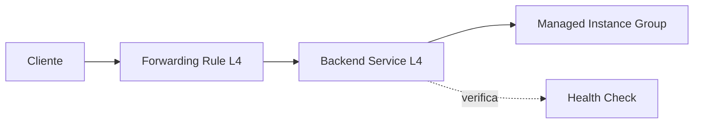

# Balanceador de Carga de Red (L4)
> **Resumen**: Balancea tráfico **TCP/UDP** a nivel de transporte (capa 4). Es **regional** y de tipo **passthrough**: preserva IP/puerto de origen y no interpreta HTTP. Ideal para latencia baja y protocolos no HTTP. citeturn20search1

## 1) Analogía Feynman
Como un **conmutador** que envía llamadas según el número marcado (IP/puerto) sin escuchar la conversación. citeturn20search1

## 2) Arquitectura mínima


## 3) ¿Cuándo usarlo?
- Protocolos **no HTTP** (bases de datos, juegos, streaming custom).
- **Baja latencia**, necesidad de **IP de origen** real en el backend.
- **Simplicidad** de capa 4 vs reglas L7.

## 4) Pasos rápidos (gcloud – backend services modernos)
> Reemplaza variables `REGION`, `ZONE`, `MIG_NAME`, `PORT`.
```bash
# Health check TCP
gcloud compute health-checks create tcp l4-hc --port=PORT

# Backend service L4
gcloud compute backend-services create l4-bs   --region=REGION   --protocol=TCP   --health-checks=l4-hc

# Asociar MIG
gcloud compute backend-services add-backend l4-bs   --region=REGION   --instance-group=MIG_NAME   --instance-group-zone=ZONE

# IP y regla de reenvío
gcloud compute addresses create l4-ip --region=REGION

gcloud compute forwarding-rules create l4-fr   --region=REGION   --address=l4-ip   --ports=PORT   --backend-service=l4-bs   --load-balancing-scheme=EXTERNAL
```

> **Nota (legacy)**: también existe la ruta con **target pools** (histórica). Para nuevas implementaciones, usa **backend services**. citeturn20search1

## 5) Seguridad y red
- Abrir **firewall** para **health checks** y **puerto del servicio**.
- Definir **subnets** y rutas en la **VPC**. → [[virtual_private_cloud_networking_updated]]
- Encaja en la **defensa en profundidad** (edge, DoS, monitoreo). → [[gcp_seguridad_disenio_en_capas_feynman]]

## 6) Troubleshooting
- `get-health` en backend service.
- Revisar **firewall** y **zonas** del MIG.
- Verificar que el puerto del backend escuche y responda al HC.

## 7) Tarjetas Anki
- **P:** ¿Qué significa *passthrough* en L4? **R:** El LB no termina la conexión; entrega el tráfico con IP/puerto de origen preservados.
- **P:** ¿Cuándo evitar L4? **R:** Cuando necesitas reglas por URL/host o TLS gestionado (usa L7).
