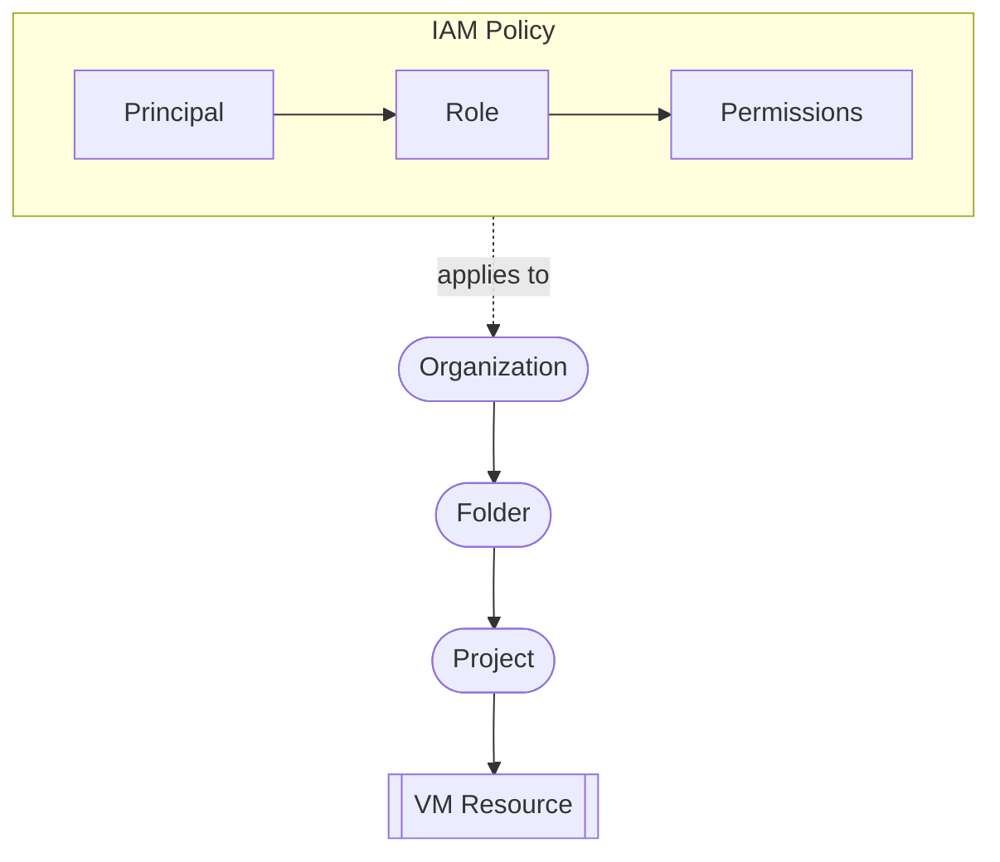

# IAM en Google Cloud (Introducción)
> **Resumen en una frase**: IAM define **quién** puede hacer **qué** y **sobre qué recursos**, usando políticas que combinan **principales, roles y permisos**, aplicables e **heredables** en la jerarquía de GCP.

## 1) Analogía sencilla (Feynman)
Imagina un **edificio corporativo**:
- **Organización** = todo el edificio.
- **Carpetas** = pisos o departamentos.
- **Proyectos** = oficinas.
- **Recursos** = escritorios, computadores, equipos.
IAM funciona como **la oficina de seguridad**: decide *quién* entra, a *dónde* y *qué puede hacer* allí.

## 2) Conceptos fundamentales
### Principales ("who")
- Cuentas de Google
- Grupos de Google
- Service accounts
- Dominios de Cloud Identity

### Roles ("can do what")
- Un rol = **colección de permisos**.
- Al asignar un rol a un principal, otorgas **todos sus permisos**.

### Herencia en la jerarquía
IAM se aplica sobre nodos de la jerarquía: **Organización → Carpetas → Proyectos → Recursos**.
La política aplicada en un nivel afecta **todo lo que está por debajo**.  
→ Relacionado: [[herarquia_gcp]]

### Reglas deny
- Se evalúan **antes** que las reglas allow.
- También **se heredan** hacia abajo.

## 3) Tipos de roles en IAM
### 1) Roles básicos
- **Viewer**: ve recursos.
- **Editor**: ve y modifica.
- **Owner**: permisos completos + gestión de permisos + billing.
- **Billing Admin**: gestiona facturación, pero **no** modifica recursos.
> Nota: Son muy amplios; no recomendados para datos sensibles.

### 2) Roles predefinidos
- Específicos a cada servicio.
- Ejemplos en Compute Engine: `instanceAdmin`.
- Se aplican en **organización**, **carpeta** o **proyecto**.

### 3) Roles personalizados (custom roles)
- Para permisos muy específicos.
- Útiles para **least privilege**.
- Solo se pueden usar en **proyecto** o **organización**.
- Necesitas **administrar sus permisos**, por lo que muchos prefieren predefinidos.

## 4) Ejemplo práctico (mini)
Quieres permitir a un analista **detener e iniciar** VMs, pero no modificarlas:
- NO uses `editor` (demasiado amplio).
- Usa un **custom role** con permisos limitados: `compute.instances.stop`, `compute.instances.start`.

## 5) Diagrama conceptual IAM + jerarquía

## 6) Preguntas Feynman (auto‑chequeo)
1. ¿Qué relación existe entre IAM y la jerarquía de GCP? (pista: herencia)
2. ¿Qué diferencia hay entre **viewer**, **editor** y **owner**?
3. ¿Dónde se pueden aplicar **roles personalizados**?
4. ¿Por qué los roles básicos pueden ser peligrosos?
5. ¿Cuándo conviene un rol predefinido vs uno personalizado?

## 7) Tarjetas Anki
Q: Definición de principal.
A: Identidad (cuenta, grupo, service account, dominio).

Q: ¿Qué es un rol?
A: Conjunto de permisos.

Q: Orden de evaluación IAM.
A: **Deny → Allow**.

Q: Tipos de roles.
A: Básicos, predefinidos, personalizados.

Q: Restricción de roles personalizados.
A: Solo nivel **proyecto** u **organización**.

## 8) Glosario
- **Principal**: identidad que recibe permisos.
- **Rol**: conjunto de permisos.
- **Permiso**: acción puntual (ej. `compute.instances.start`).
- **Política IAM**: asignación de roles a principales.
- **Deny policy**: bloquea permisos incluso si existen allows.

---
### Registro personal (aprendizajes/notas)
- Lección 1: Siempre comenzar con **least privilege**.
- Lección 2: Roles básicos solo para casos muy controlados.
- Lección 3: Prefiero predefinidos salvo que necesite granularidad extrema.
