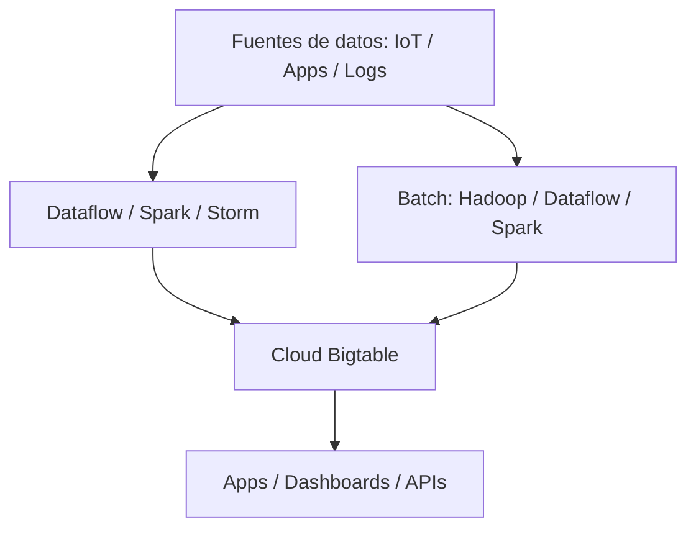

# Cloud Bigtable en Google Cloud
> **Resumen en una frase:** Bigtable es la base de datos **NoSQL de big data** de Google, diseñada para procesar **petabytes**, manejar **altísima velocidad de lectura/escritura**, y servir aplicaciones críticas como Search, Analytics, Maps y Gmail.

## 1) Analogía sencilla (Feynman)
Imagina una **mesa gigante con millones de filas**, distribuida en cientos de máquinas, pero tú la ves como una sola tabla.
- Puede crecer horizontalmente sin perder rendimiento.
- Es perfecta para datos **ordenados por tiempo**, métricas, sensores y analíticas a gran escala.

## 2) ¿Qué es Bigtable?
- Base de datos **NoSQL, wide-column**, distribuida.
- Diseñada para **latencias bajas**, incluso bajo cargas masivas.
- Altísimo rendimiento: **decenas de miles de lecturas/escrituras por segundo**.
- Potencia servicios internos de Google como **Search, Analytics, Maps y Gmail**.

## 3) ¿Cuándo elegir Bigtable?
Bigtable es ideal si:
- Trabajas con **> 1 TB** de datos estructurados o semiestructurados.
- Necesitas **alto throughput** y bajas latencias.
- No necesitas transacciones con semánticas relacionales fuertes.
- Manejas **series de tiempo**, IoT, logs o datos con ordenamiento natural.
- Ejecutas **big data**, **ML**, procesamiento batch o **streaming**.

## 4) Integración con servicios
Bigtable puede interactuar con:
- **Servicios de aplicaciones** (dashboards, APIs).
- Herramientas y capas REST: **HBase REST Server**, HBase API.
- Servicios de streaming como:
  - **Dataflow Streaming**
  - **Spark Streaming**
  - **Storm**
- Procesamiento batch:
  - **Hadoop MapReduce**
  - **Dataflow**
  - **Spark**

> Es común escribir datos procesados o agregados nuevamente en Bigtable o enviarlos a otra base de datos.

## 5) Diagrama conceptual

## 6) Casos de uso comunes
- IoT (sensores con lecturas constantes).
- Analítica de usuarios (clickstream, comportamiento).
- Finanzas (series temporales, precios, riesgo).
- Machine Learning (features stores simples, datos históricos masivos).
- Data pipelines (ingesta continua + batch processing).

## 7) Preguntas Feynman
1. ¿Por qué Bigtable es ideal para datos con orden natural o series de tiempo?
2. ¿En qué se diferencia de Firestore o Cloud SQL?
3. ¿Por qué Bigtable escala horizontalmente sin comprometer latencia?
4. ¿Qué frameworks pueden enviar datos a Bigtable?

## 8) Tarjetas Anki
**Q:** ¿Qué tipo de base es Bigtable?  \
**A:** Base de datos NoSQL de big data, distribuida y de alta velocidad.

**Q:** ¿Qué tamaño mínimo de datos suele justificar Bigtable?  \
**A:** Más de **1 TB**.

**Q:** ¿Bigtable sirve para SQL o joins?  \
**A:** No, es NoSQL tipo wide-column sin joins.

**Q:** ¿Qué servicios de Google usa Bigtable internamente?  \
**A:** Search, Analytics, Maps, Gmail.

---
### Registro personal
- Bigtable es la opción cuando **rendimiento + escala** son prioridad.
- Perfecto para pipelines híbridos streaming + batch.
