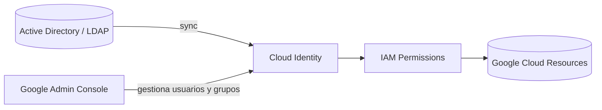

# Cloud Identity en Google Cloud
> **Resumen en una frase**: Cloud Identity permite gestionar usuarios, grupos y políticas de acceso de forma centralizada, integrando identidades corporativas (AD/LDAP) con Google Cloud.

## 1) Analogía sencilla (Feynman)
Piensa en una **recepción corporativa unificada**:
- Antes, cada empleado entraba con su propia llave (Gmail personal).
- Si alguien renunciaba, nadie podía quitarle fácilmente la llave.
- Cloud Identity es como instalar una **consola central de acceso** donde los administradores controlan quién entra y quién no, usando las **mismas credenciales corporativas**.

## 2) Problema sin Cloud Identity
- Se usan cuentas Gmail personales.
- No hay gestión centralizada.
- No puedes desactivar accesos de forma inmediata.
- Usuarios y grupos no están conectados a la organización real.
→ Esto puede causar **riesgos de seguridad** y **pérdida de control**.

## 3) ¿Qué resuelve Cloud Identity?
- Administra usuarios y grupos desde la **Google Admin Console**.
- Puedes **desactivar cuentas** cuando una persona deja la organización.
- Permite usar las **mismas credenciales** que en AD/LDAP.
- Integra la identidad corporativa con **Google Cloud e IAM**.
→ Relacionado: [[IAM_intro]]

## 4) Flujo típico de uso
1. Configuras Cloud Identity o Google Workspace.
2. Los usuarios corporativos se sincronizan desde AD/LDAP.
3. Los administradores gestionan accesos desde la Admin Console.
4. IAM usa esas identidades para permisos en Cloud.
5. Cuando alguien se va: desactivas su cuenta → pierde acceso a GCP.

## 5) Ediciones disponibles
- **Cloud Identity (Free)**: identidad corporativa + grupos.
- **Cloud Identity Premium**: incluye administración de dispositivos móviles (MDM) y funciones avanzadas.
- Si ya tienes **Google Workspace**, entonces ya tienes Cloud Identity integrado.

## 6) Diagrama conceptual

## 7) Relación con otras notas
- **IAM_intro**: Cloud Identity define los **principales** que IAM usará.
- **herarquia_gcp**: los usuarios gestionados por Cloud Identity acceden a recursos dentro de proyectos/carpetas.
- **Seguridad en capas**: Cloud Identity fortalece la **capa de identidad**, parte crítica del diseño de seguridad.

## 9) Tarjetas Anki
Q: ¿Qué problema resuelve Cloud Identity?  
A: Gestionar usuarios/grupos de forma centralizada con control inmediato.

Q: ¿Qué integra Cloud Identity con GCP?  
A: Identidades corporativas (AD/LDAP) con IAM.

Q: ¿Qué pasa cuando un usuario es desactivado?  
A: Pierde acceso inmediatamente a recursos de Google Cloud.

## 10) Registro personal
- Cloud Identity es clave para **escala organizacional**.
- Próxima nota sugerida: *Federación con AD / SAML / SCIM*.
