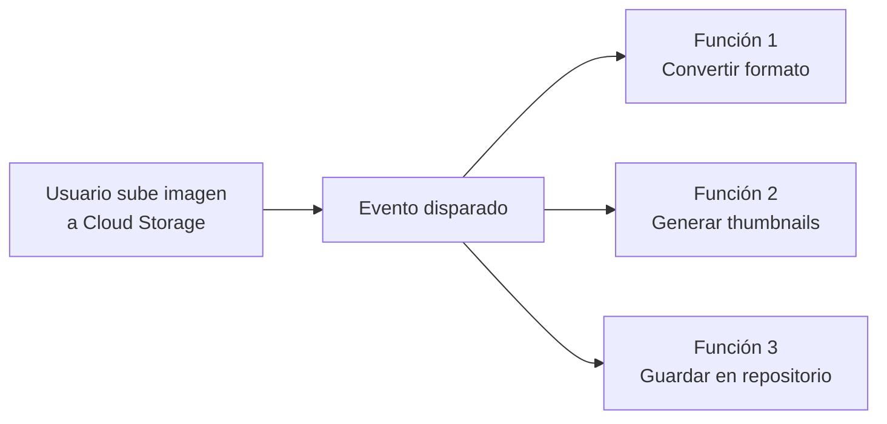

# Cloud Run Functions en Google Cloud
> **Resumen en una frase:** Cloud Run Functions es una solución de cómputo ligera, event-driven y asíncrona que permite escribir funciones de propósito único que responden a eventos de GCP sin gestionar servidores ni entornos de ejecución.

---

## 1) Analogía sencilla (Feynman)
Imagina un **timbre inteligente en tu casa**:
- Solo suena cuando alguien toca el timbre (evento).
- No hay nadie esperando en la puerta las 24 horas (no hay servidor corriendo).
- En el momento que se activa, ejecuta exactamente una tarea: avisar que alguien llegó.
- Cuando termina, desaparece hasta el próximo evento.

Cloud Run Functions es ese timbre: **existe solo cuando hay un evento que procesar**.

---

## 2) ¿Qué es Cloud Run Functions?
- Solución de cómputo **ligera**, **event-driven** y **asíncrona**.
- Permite crear funciones **pequeñas y de propósito único**.
- Responde a **eventos de GCP** sin necesidad de gestionar servidor ni runtime.
- Ideal para construir flujos de trabajo a partir de tareas individuales de lógica de negocio.
- También puede **conectar y extender** servicios de GCP entre sí.

---

## 3) Ejemplo concreto: procesamiento de imágenes

Sin Cloud Run Functions: tendrías que provisionar cómputo para estas tareas **todo el tiempo**, aunque solo ocurran una vez al día.  
Con Cloud Run Functions: el cómputo existe **solo mientras se ejecuta la función**.

---

## 4) Disparadores (Triggers)

| Tipo de trigger | Modo de ejecución | Ejemplo |
|----------------|-------------------|---------|
| **Cloud Storage** | Asíncrono | Imagen subida → procesar archivo |
| **Pub/Sub** | Asíncrono | Mensaje publicado → transformar dato |
| **HTTP** | Síncrono | Request HTTP → retornar respuesta |

---

## 5) Lenguajes soportados
- Node.js
- Python
- Go
- Java
- .NET Core
- Ruby
- PHP

> Para versiones específicas de runtime, consultar la documentación oficial de GCP.

---

## 6) Modelo de precios
- Facturación con granularidad de **100 milisegundos**.
- Se cobra **solo mientras el código está corriendo**.
- Si no hay eventos → costo = 0.

---

## 7) Casos de uso típicos
- Procesamiento de archivos al subirse a Cloud Storage (imágenes, CSVs, JSONs).
- Reaccionar a mensajes en Pub/Sub para transformar o enrutar datos.
- Webhooks y endpoints HTTP ligeros.
- Automatización de flujos entre servicios de GCP.
- Pipelines de datos event-driven (ETL ligero).

---

## 8) Preguntas Feynman
1. ¿Por qué Cloud Run Functions es más eficiente que tener un servidor corriendo para tareas ocasionales?
2. ¿Cuál es la diferencia entre un trigger asíncrono y uno síncrono?
3. ¿Qué problema resuelve Cloud Run Functions que Cloud Run (contenedores) no resuelve de forma natural?
4. ¿Cómo conectarías Cloud Storage con BigQuery usando Cloud Run Functions?

---

## 9) Tarjetas Anki
**Q:** ¿Qué tipo de funciones ejecuta Cloud Run Functions?  
**A:** Funciones pequeñas, de propósito único, que responden a eventos de GCP.

**Q:** ¿Qué servicios pueden disparar Cloud Run Functions de forma asíncrona?  
**A:** Cloud Storage y Pub/Sub.

**Q:** ¿Qué tipo de trigger permite ejecución síncrona?  
**A:** HTTP invocation.

**Q:** ¿Cuál es la granularidad de facturación?  
**A:** 100 milisegundos, solo mientras el código corre.

**Q:** ¿Cloud Run Functions requiere gestionar servidores o runtimes?  
**A:** No, es completamente serverless.

---

**Q:** ¿Ejecutar código cuando ocurre un evento (un objeto que llega a un bucket), sin endpoint HTTP público?
**A:** **Cloud Run functions** — es *event-driven*: lo dispara el evento, no una petición.

### Registro personal
- Cloud Run Functions es ideal para la lógica "entre servicios": reaccionar a un evento y desencadenar una acción.
- En pipelines de datos, puede usarse como disparador ligero antes de invocar procesos más pesados en Dataflow o BigQuery.
- Ver también: [[cloud_run_intro]] para contenedores serverless de larga ejecución.
