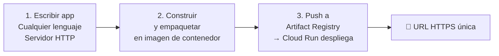
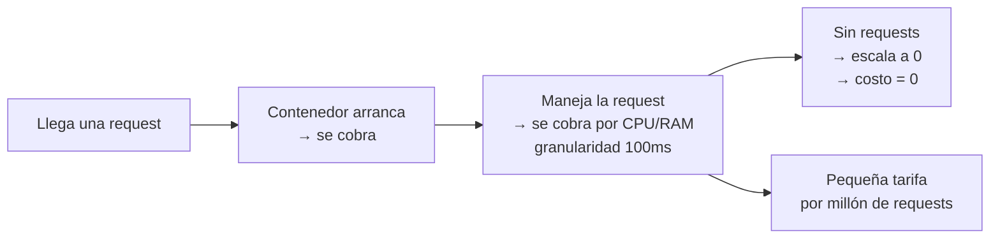

# Cloud Run en Google Cloud
> **Resumen en una frase:** Cloud Run es una plataforma serverless que ejecuta contenedores stateless ante solicitudes web o eventos Pub/Sub, escala desde cero de forma instantánea y cobra solo por los recursos realmente usados con granularidad de 100ms.

---

## 1) Analogía sencilla (Feynman)
Imagina un **taxi bajo demanda** vs. tener un auto propio:

- **GKE / VM**: tienes tu propio auto. Tú lo mantienes, pagas el seguro y el garaje 24/7, lo uses o no.
- **Cloud Run**: llamas un taxi solo cuando lo necesitas. Aparece en segundos, te lleva a donde quieres y **solo pagas el trayecto**. Cuando no hay pasajeros, no hay costo.

El "taxi" es tu contenedor: arranca cuando llega una petición y se apaga cuando ya no hay tráfico.

---

## 2) ¿Qué es Cloud Run?
- Plataforma de cómputo **totalmente gestionada** (serverless).
- Ejecuta contenedores **stateless** activados por:
  - **Solicitudes web (HTTP/HTTPS)**.
  - **Eventos de Pub/Sub**.
- Construido sobre **Knative**: API y runtime open-source sobre Kubernetes.
- Puede correr en:
  - Google Cloud (totalmente gestionado).
  - Google Kubernetes Engine (GKE).
  - Cualquier entorno donde corra Knative.

---

## 3) Características clave

| Característica | Detalle |
|---------------|---------|
| **Serverless** | Sin gestión de infraestructura; foco total en el código |
| **Escalado automático** | Desde 0 hasta N instancias de forma casi instantánea |
| **HTTPS automático** | Cloud Run gestiona el cifrado; tú solo manejas la lógica |
| **Cualquier lenguaje** | Cualquier binario compilado para Linux 64-bit |
| **Pago por uso** | Solo cuando el contenedor maneja requests (granularidad 100ms) |

---

## 4) Flujo de desarrollo (3 pasos)

1. **Escribe** tu aplicación en cualquier lenguaje; debe levantar un servidor que escuche requests web.
2. **Empaqueta** la app en una imagen de contenedor.
3. **Sube** la imagen a **Artifact Registry**; Cloud Run la despliega automáticamente y te retorna una URL HTTPS única.

---

## 5) Dos flujos de trabajo: Container vs. Source

| Flujo | ¿Qué despliegas? | ¿Quién construye el contenedor? | Ideal para |
|-------|-----------------|-------------------------------|-----------|
| **Container-based** | Imagen de contenedor | Tú | Máximo control y flexibilidad |
| **Source-based** | Código fuente directamente | Cloud Run (usando **Buildpacks**) | Simplicidad, imagen segura y consistente |

> **Buildpacks** es un proyecto open-source que Cloud Run usa en el flujo source-based para construir y empaquetar automáticamente el código en una imagen optimizada.

---

## 6) Modelo de precios

- **Pagas**: tiempo de CPU + RAM mientras el contenedor maneja requests (y al arrancar/apagar).
- **No pagas**: si no hay requests activas.
- **Tarifa adicional**: pequeña cuota por cada millón de requests servidas.
- **Precio sube** con más vCPU y memoria asignados al contenedor.

---

## 7) Lenguajes y compatibilidad
Cloud Run puede ejecutar **cualquier binario compilado para Linux 64-bit**, lo que incluye prácticamente todo:

**Populares**: Java · Python · Node.js · PHP · Go · C++

**Menos comunes (también soportados)**: Cobol · Haskell · Perl

> La única condición: **la app debe manejar requests web**.

---

## 8) Cloud Run vs. GKE

| Aspecto | Cloud Run | GKE |
|---------|-----------|-----|
| Gestión de infraestructura | Ninguna (serverless) | Parcial (Autopilot) o total (Standard) |
| Escalado a cero | ✅ Sí | ❌ No (nodos siempre activos) |
| Modelo de costo | Por uso exacto | Por nodos aprovisionados |
| Flexibilidad de red/config | Limitada | Alta |
| Ideal para | Apps web, APIs, microservicios event-driven | Workloads complejos, stateful, multi-servicio |

---

## 9) Preguntas Feynman
1. ¿Qué significa que Cloud Run es "serverless"?
2. ¿Por qué Cloud Run puede escalar a cero y GKE no?
3. ¿Cuándo elegirías el flujo source-based sobre el container-based?
4. ¿Qué rol cumple Knative en Cloud Run?
5. ¿Qué condición debe cumplir tu app para correr en Cloud Run?

---

## 10) Tarjetas Anki
**Q:** ¿Qué tipo de contenedores ejecuta Cloud Run?  
**A:** Contenedores stateless activados por requests HTTP/HTTPS o eventos Pub/Sub.

**Q:** ¿Sobre qué tecnología está construido Cloud Run?  
**A:** Knative, un runtime open-source sobre Kubernetes.

**Q:** ¿Cuál es la granularidad de cobro en Cloud Run?  
**A:** 100 milisegundos de uso de recursos del contenedor.

**Q:** ¿Qué pasa con el costo cuando no hay requests?  
**A:** El contenedor escala a 0 y el costo es cero.

**Q:** ¿Qué herramienta usa Cloud Run para el flujo source-based?  
**A:** Buildpacks (proyecto open-source).

**Q:** ¿Qué necesita tu app para ser compatible con Cloud Run?  
**A:** Ser un binario Linux 64-bit que maneje requests web.

---

### Registro personal
- Cloud Run es la opción más simple para exponer un modelo ML o una API rápidamente en GCP sin gestionar infraestructura.
- El flujo source-based es ideal para prototipos; el container-based para producción con control total.
- Knative es el puente que permite portar Cloud Run fuera de GCP si se necesita.
- Próximo paso: revisar **Artifact Registry** como repositorio central de imágenes de contenedores → `[[artifact_registry]]`.
