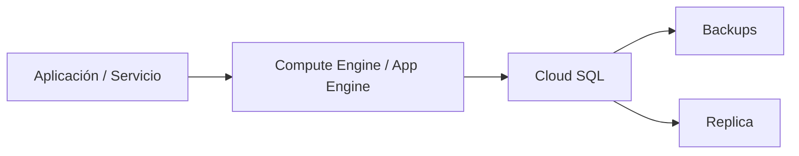

# Cloud SQL en Google Cloud
> **Resumen en una frase:** Cloud SQL es el servicio de **bases de datos relacionales totalmente gestionadas** de Google Cloud, compatible con **MySQL**, **PostgreSQL** y **SQL Server**, delegando a Google las tareas operativas como parches, backups, replicación y mantenimiento.

## 1) Analogía sencilla (Feynman)
Imagina que necesitas una base de datos, pero no quieres convertirte en **administrador de servidores**.
Cloud SQL es como **alquilar una base de datos con personal técnico incluido**:
- Ellos hacen backups.
- Ellos instalan parches.
- Ellos se encargan de la replicación.
- Tú solo **usas** la base de datos.

## 2) ¿Qué es Cloud SQL?
- Base de datos **relacional** totalmente administrada.
- Motores soportados:
  - **MySQL**
  - **PostgreSQL**
  - **SQL Server**
- No requiere instalación ni mantenimiento manual.
- Escala hasta:
  - **128 CPU cores**
  - **864 GB RAM**
  - **64 TB de almacenamiento**

## 3) Replicación y alta disponibilidad
Cloud SQL soporta replicación automática desde:
- Una instancia primaria de Cloud SQL.
- Una base de datos primaria **externa**.
- Instancias MySQL externas.

Esto habilita escenarios híbridos, migraciones y failovers.

## 4) Backups y recuperación
- **Backups gestionados** por Google.
- El costo de la instancia incluye **7 backups**.
- Backups almacenados de forma cifrada y disponibles para **restore**.

## 5) Seguridad
Cloud SQL aplica múltiples capas de seguridad:
- **Encriptación en reposo** de datos, archivos temporales y backups.
- **Encriptación en tránsito** para tráfico interno y externo.
- **Firewall de red** para controlar acceso a cada instancia.
- Integración con **IAM** para controlar quién puede administrar las instancias.

→ Ver también: [[IAM_intro]]

## 6) Conectividad
Una instancia de Cloud SQL puede ser accedida por:
- **App Engine**, usando drivers estándar (Connector/J, MySQLdb, etc.).
- **Compute Engine**, autorizando la instancia para acceso privado y colocándola en la misma zona.
- **Servicios externos**: herramientas como SQL Workbench, Toad, u otros clientes SQL estándar.

## 7) Diagrama conceptual

## 8) Casos de uso
- Bases de datos OLTP tradicionales.
- Migración de bases de datos on‑prem a GCP.
- Aplicaciones que requieren compatibilidad con herramientas SQL estándar.
- Sistemas que necesitan **alta disponibilidad** y **copias de seguridad automáticas**.

## 9) Preguntas Feynman
1. ¿Qué tareas administrativas elimina Cloud SQL?  
2. ¿Qué motores soporta?  
3. ¿Cómo acceden las instancias de Compute Engine a Cloud SQL?  
4. ¿Qué rol cumple la replicación externa?

## 10) Tarjetas Anki
**Q:** ¿Qué tipos de bases soporta Cloud SQL?  **A:** MySQL, PostgreSQL, SQL Server.

**Q:** ¿Qué incluye el costo de una instancia?  **A:** Hasta **7 backups** gestionados.

**Q:** ¿Cloud SQL requiere instalación?  **A:** No, es totalmente administrado.

**Q:** ¿Cloud SQL cifra datos en tránsito y en reposo?  **A:** Sí, siempre.

---
### Registro personal
- Cloud SQL simplifica operaciones que en on‑prem tomarían horas.
- Ideal para mantener compatibilidad con sistemas existentes sin administrar servidores.
