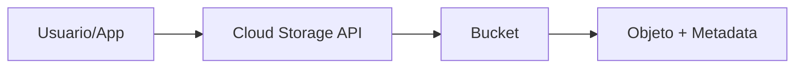

# Cloud Storage en Google Cloud
> **Resumen en una frase**: Cloud Storage es el servicio de **almacenamiento de objetos** de Google Cloud: durable, altamente disponible, escalable y seguro, ideal para almacenar BLOBs como imágenes, videos, respaldos y datos intermedios.

## 1) Analogía sencilla (Feynman)
Imagina un **almacén gigante** donde cada caja (objeto) incluye:
- El contenido (datos binarios).
- Una tarjeta con datos importantes (metadata).
- Un código único global (URL) para encontrarla.
No hay estanterías ni carpetas: solo cajas independientes. Tú pides la caja por su código y el almacén la encuentra.

## 2) ¿Qué es el almacenamiento de objetos?
- No usa carpetas reales como un sistema de archivos.
- Cada objeto contiene **datos + metadata + identificador único**.
- Interactúa muy bien con **web y APIs** porque los objetos se acceden vía **URLs**.
- Ideal para BLOBs: imágenes, audio, video, archivos grandes.

## 3) ¿Qué es Cloud Storage?
- Servicio **totalmente administrado**, **durable** y **escalable**.
- Almacena cualquier cantidad de datos y permite recuperarlos tantas veces como sea necesario.
- Casos de uso:
  - Servir contenido web.
  - Backups y archivado.
  - Distribución de datos grandes.
  - Procesamiento de datos (resultado intermedio).

## 4) Buckets: organización y ubicación
Los objetos se almacenan dentro de **buckets**:
- Deben tener **nombre único global**.
- Requieren una **ubicación**:
  - **Región** (ej: `us-central1`).
  - **Multi-región** (ej: `eu`).
- Elegir ubicación según **latencia** para tus usuarios.

## 5) Inmutabilidad y versionamiento
### Inmutabilidad
Los objetos **no se editan**: cada cambio crea una **nueva versión**.

### Versionamiento opcional
- Si el **versionamiento está desactivado**: la nueva versión **sobrescribe** la anterior.
- Si el **versionamiento está activado**:
  - Cloud Storage conserva **todas las versiones**.
  - Puedes **restaurar**, **listar** o **eliminar** versiones individuales.

## 6) Control de acceso: IAM y ACLs
### IAM (lo recomendado)
- Los permisos se heredan: **proyecto → bucket → objeto**.
- Roles comunes: `storage.admin`, `storage.objectViewer`, etc.
→ Relacionado: [[IAM_intro]]

### ACLs (uso avanzado)
Se usan cuando se necesita control **más granular**:
- Definen **quién** (scope) y **qué acción** (permisos: lectura, escritura).
- Se aplican a objetos específicos.

## 7) Políticas de ciclo de vida
Permiten automatizar administración de objetos:
- Borrar objetos antiguos (ej: >365 días).
- Borrar objetos creados antes de una fecha.
- Mantener solo **las últimas N versiones**.
Esto ayuda a reducir costos y mantener orden.

## 8) Diagrama (conceptual)

## 9) Preguntas Feynman
1. ¿Por qué Cloud Storage no usa carpetas reales?  
2. ¿Qué pasa cuando modificas un objeto?  
3. ¿En qué caso necesitas ACLs?  
4. ¿Por qué la ubicación del bucket afecta latencia?

## 10) Tarjetas Anki
**Q:** ¿Qué es un objeto en Cloud Storage?  **A:** Datos binarios + metadata + ID único global.

**Q:** ¿Qué es un bucket?  **A:** Contenedor con nombre global único y ubicación geográfica.

**Q:** ¿Para qué sirve el versionamiento?  **A:** Mantener historial de versiones y restaurar estados anteriores.

**Q:** Diferencia IAM vs ACLs.  **A:** IAM para permisos heredados; ACLs para control fino por objeto.

---
### Registro personal
- Recordar que Cloud Storage es base para pipelines de datos grandes.
- Siempre elegir ubicación según usuarios y cumplimiento.
