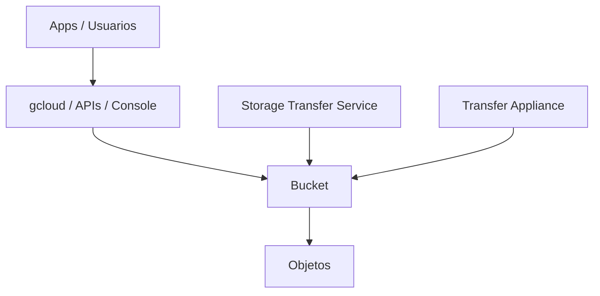

# Cloud Storage en Google Cloud
> **Resumen**:  [[cloud_storage]] es el servicio de almacenamiento de objetos de GCP: duradero, seguro, escalable y económico. Soporta 4 clases de almacenamiento, versionamiento, lifecycle management, Autoclass, múltiples métodos de transferencia y encriptación por defecto.

## 1) Recordatorio: ¿Qué es el almacenamiento de objetos?
- Cada *objeto* contiene **datos binarios + metadata + ID único global**.
- No utiliza carpetas reales — estructura plana.
- Orientado a BLOBs: imágenes, video, audio, backups, artefactos.

## 2) Cloud Storage: componentes básicos
- Buckets con nombre **único global**.
- Ubicación: **regional**, **multi-regional** o **dual-regional**.
- Objetos **inmutables** → cada cambio crea una nueva versión.
- Versionamiento opcional.

---
# 3) Clases de almacenamiento (4 niveles)
Las clases se diferencian por **frecuencia de acceso**, **costos** y **duración mínima**.

## ⭐ 3.1 Standard Storage (Hot)
- Para datos accedidos **frecuentemente**.
- Ideal para:
  - Contenido web.
  - Procesamiento activo.
  - Datos de vida corta.

## 🟦 3.2 Nearline Storage
- Acceso **infrecuente**: ~1 vez al mes.
- Uso típico:
  - Backups.
  - Archivos multimedia de baja demanda.
  - Archivos fríos pero aún requeridos periódicamente.

## ❄️ 3.3 Coldline Storage
- Acceso muy poco frecuente: **cada 90 días o menos**.
- Uso típico:
  - Archivos de DR.
  - Archivos históricos.
  - Backups de largo plazo.

## 📦 3.4 Archive Storage
- La opción **más económica**.
- Acceso esperado: **< 1 vez al año**.
- Tiene **365 días de permanencia mínima**.
- Uso típico:
  - Archivado a largo plazo.
  - Recuperaciones puntuales.
  - DR de muy bajo costo.

---
# 4) Características comunes a todas las clases
- **Almacenamiento ilimitado**, sin tamaño mínimo.
- **Acceso global**.
- **Alta durabilidad** (multi-región y dual-región permiten geo‑redundancia).
- **Baja latencia**, infraestructura distribuida.
- APIs, herramientas y seguridad **uniformes**.

---
# 5) Autoclass
- Detecta automáticamente los **patrones de acceso**.
- Baja los objetos a clases más frías si no se usan.
- Sube automáticamente a **Standard** si hay accesos.
- Reduce costos sin configuración manual.

---
# 6) Seguridad en Cloud Storage
- **Encriptación en servidor (SSE) por defecto**, antes de escribir en disco.
- **Encriptación en tránsito**: HTTPS/TLS.
- Control de acceso:
  - IAM heredado (proyecto → bucket → objeto).
  - ACLs sólo cuando se requiere control **muy granular**.

→ Relacionado: [[IAM_intro]]

---
# 7) Lifecycle Management
Automatiza acciones basadas en reglas:
- Borrar objetos > N días.
- Conservar solo las últimas *N* versiones.
- Mover entre clases según antigüedad.
- Depurar buckets grandes.

---
# 8) Métodos para ingresar datos a Cloud Storage

## 🔹 8.1 Transferencias pequeñas / medianas
- **gcloud storage** (CLI).
- **Drag & drop** desde Console (Chrome).

## 🔹 8.2 Transferencias grandes (TB → PB)
### Storage Transfer Service
- Importa datos desde:
  - Otras nubes.
  - Otros buckets.
  - Endpoints HTTP(S).
- Permite **jobs programados**, reintentos y controles de integridad.

### Transfer Appliance
- Appliance físico enviado por Google.
- Capacidad de **hasta 1 PB**.
- Se carga localmente y se envía al centro de subida.

---
# 9) Integraciones con otros servicios de Google Cloud
- **BigQuery**: importar/exportar tablas.
- **Cloud SQL**: backups y restores.
- **App Engine**: logs, assets, archivos.
- **Compute Engine**:
  - Imágenes.
  - Startup scripts.
  - Artefactos.
- **Firestore**: backups.

---
# 10) Diagrama general

---
# 11) Preguntas Feynman
1. ¿Qué clase usarías para datos accedidos diariamente?  
2. ¿Por qué Cloud Storage no edita objetos?  
3. ¿Cuándo elegir ACLs sobre IAM?  
4. ¿Qué herramienta usarías para mover 500 TB desde otro proveedor?

---
## 12) Tarjetas Anki
**Q:** ¿Cuántas clases ofrece Cloud Storage?  
**A:** 4: Standard, Nearline, Coldline, Archive.

**Q:** ¿Qué clase tiene permanencia mínima de 365 días?  
**A:** Archive.

**Q:** ¿Qué hace Autoclass?  
**A:** Ajusta automáticamente la clase según accesos.

**Q:** ¿Qué servicio permite transferencias PB‑scale?  
**A:** Transfer Appliance.

---
### Registro personal
- La clave del ahorro: elegir bien la clase + lifecycle + Autoclass.
- Archive es ideal para DR extremo; Standard para contenido interactivo.
