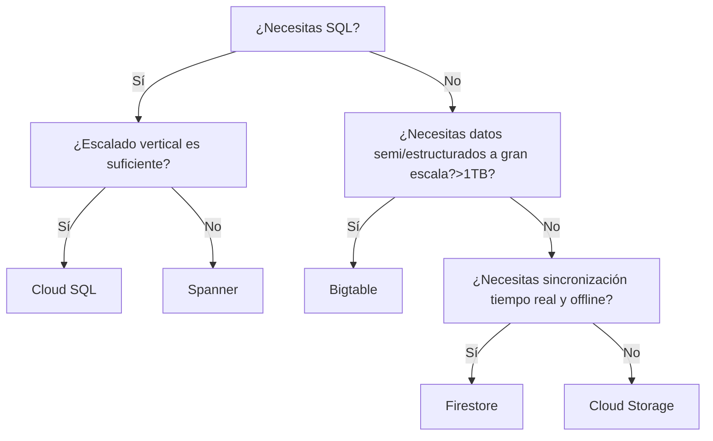

# Comparación de las opciones de almacenamiento en Google Cloud
> **Resumen en una frase:** Esta nota te permite elegir rápidamente entre **Cloud Storage, Cloud SQL, Spanner, Firestore y Bigtable**, entendiendo **para qué sirve cada uno**, **sus capacidades**, **casos de uso**, y enlazando a sus notas detalladas.

---
# 1) Tabla comparativa general

| Servicio | Mejor para | Capacidad | Comentarios clave |
|---------|------------|-----------|-------------------|
| **Cloud Storage** | Almacenar **objetos inmutables** (>10 MB): imágenes, videos, backups | **Petabytes** (hasta **5 TB/objeto**) | Object Storage. Versionamiento, Autoclass, múltiples clases. [[cloud_storage_classes]], [[cloud_storage]]|
| **Cloud SQL** | SQL completo, apps tradicionales, OLTP, web frameworks | Hasta **64 TB** | Relacional gestionado (MySQL/Postgres/SQL Server). Escala **verticalmente**. [[cloud_sql]] |
| **Spanner** | SQL con **escalado horizontal**, consistencia fuerte y transacciones globales | **Petabytes** | Relacional distribuido. Ideal para sistemas críticos y globales. [[spanner]] |
| **Firestore** | Apps móviles/web, sincronización en tiempo real, offline, NoSQL documentos | **Terabytes** (máx. **1 MB por documento**) | NoSQL document. Indexación automática, tiempo real. [[firestore]] |
| **Bigtable** | Big data NoSQL, series de tiempo, IoT, ML, lecturas/escrituras masivas | **Petabytes** (máx. **10 MB/celda**, **100 MB/fila**) | Wide-column NoSQL. No SQL/joins. Ultra escalable. [[bigtable]] |

---
# 2) ¿Cuándo elegir cada uno? (Guía rápida)

### ✅ **Cloud Storage** — si necesitas…
- Guardar **objetos grandes** (imágenes, videos, artefactos).  
- Archivar datos de bajo acceso (Nearline/Coldline/Archive).  
- Distribuir contenido o almacenar backups.  
- Capacidad sin límites hasta petabytes.

**Evítalo si** necesitas SQL, transacciones o consultas avanzadas.

---
### ✅ **Cloud SQL** — si necesitas…
- SQL **completo** (JOINs, constraints, transacciones ACID).  
- Bases de datos tradicionales para apps web/frameworks.  
- Compatibilidad con MySQL/Postgres/SQL Server.

**Límite:** escala **vertical**; no sirve para workloads globales o masivos.

---
### ✅ **Spanner** — si necesitas…
- **SQL + escalado horizontal real**.  
- Transacciones **consistentes globalmente**.  
- Altísima disponibilidad (>99.999% en multi‑región).  
- Procesar decenas de miles de IOPS.

**Ideal para**: bancos, telcos, retail global, logística.

---
### ✅ **Firestore** — si necesitas…
- Una base NoSQL muy flexible para mobile/web.  
- **Sincronización en tiempo real** entre dispositivos.  
- **Modo offline** con cache local.  
- Consultas rápidas con indexación automática.

**Limitación:** máx. **1 MB por documento**.

---
### ✅ **Bigtable** — si necesitas…
- Series de tiempo, IoT, sensores, métricas, logs.  
- Lecturas/escrituras masivas (alto throughput).  
- NoSQL wide‑column para petabytes.  
- Integración con Dataflow/Spark/ML.

**Limitación:** No soporta SQL ni transacciones multi‑fila.

---
# 3) Mapa de decisión (flowchart)

---
# 4) Comparación por tipo de workload

### 🧱 **Almacenamiento de objetos** → *Cloud Storage*
- BLOBs grandes, archivos estáticos, backups.

### 💾 **Bases de datos SQL (OLTP)** → *Cloud SQL / Spanner*
- Cloud SQL → workloads tradicionales, frameworks web, ERPs.  
- Spanner → sistemas globales, escalado horizontal.

### 📱 **Mobile / Web NoSQL** → *Firestore*
- Tiempo real, offline, sincronización, indexación automática.

### 📊 **Big Data NoSQL** → *Bigtable*
- IoT, series de tiempo, ML pipelines, analítica de usuarios.

---
# 5) Capacidad y límites (detallado)
| Servicio | Capacidad total | Límite por unidad |
|---------|-----------------|-------------------|
| **Cloud Storage** | Petabytes | 5 TB por objeto |
| **Cloud SQL** | Hasta 64 TB | N/A (según BD) |
| **Spanner** | Petabytes | N/A (sharding automático) |
| **Firestore** | Terabytes | 1 MB por documento |
| **Bigtable** | Petabytes | 10 MB/celda, 100 MB/fila |

---
# 6) ¿Y BigQuery?
No aparece en esta comparación porque **no es un servicio de almacenamiento puro**.
Su objetivo es **analítica masiva** e **interrogación interactiva de Big Data**.

---
# 7) Enlaces a notas detalladas
- 📦 **Cloud Storage** → [[cloud_storage_classes]], [[cloud_storage]]
- 🐬 **Cloud SQL** → [[cloud_sql]]
- 🌐 **Spanner** → [[spanner]]
- 📱 **Firestore** → [[firestore]]
- 📊 **Bigtable** → [[bigtable]]

---
## 8) Tarjetas Anki

**Q:** ¿Series de tiempo, IoT, sensores, alto throughput y acceso por row key?
**A:** **Bigtable** (wide-column NoSQL, petabytes, sin SQL ni joins).

**Q:** ¿SQL completo + escala global + transacciones consistentes globalmente?
**A:** **Spanner** (relacional distribuido, escalado horizontal, >99.999% en multirregión).

**Q:** ¿App móvil con sincronización offline y actualizaciones en tiempo real?
**A:** **Firestore** (NoSQL de documentos, caché local, indexación automática).

**Q:** ¿SQL completo, pero regional y con escalado vertical suficiente?
**A:** **Cloud SQL** (MySQL/Postgres/SQL Server gestionado, techo de 64 TB).

**Q:** ¿Objetos grandes e inmutables: imágenes, videos, backups, artefactos?
**A:** **Cloud Storage** (object storage, petabytes, hasta 5 TB por objeto).

**Q:** ¿Qué distingue a Cloud SQL de Spanner?
**A:** Cloud SQL escala **verticalmente** y es **regional** (techo 64 TB); Spanner escala **horizontalmente** con consistencia fuerte **global**. La palabra *global* en el escenario descarta Cloud SQL.

**Q:** ¿Por qué "es rápido y escala" no sirve como criterio para elegir base de datos?
**A:** Porque describe a casi todas. Se elige **descartando** con el requisito duro del escenario: SQL o no, global o regional, tiempo real/offline, tamaño y patrón de acceso.

**Q:** ¿Por qué BigQuery no aparece en esta comparativa?
**A:** No es almacenamiento puro: es **analítica masiva** (data warehouse), no transaccional. No tiene SDK móvil, listeners de cambios ni latencia de milisegundos.

**Q:** Límite por unidad de Firestore y de Bigtable.
**A:** Firestore: **1 MB por documento**. Bigtable: **10 MB por celda**, **100 MB por fila**.

---
### Registro personal
- Esta tabla es mi “mapa mental” para elegir storage según carga, latencia, tamaño y modelo de datos.
- Bigtable = IoT/series tiempo; Spanner = SQL global; Firestore = mobile/web; SQL = apps clásicas; Cloud Storage = binarios.
