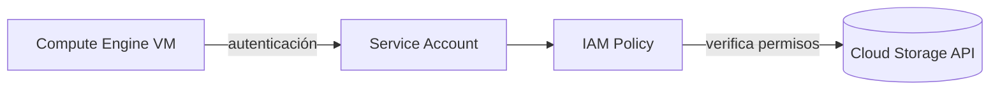

# Cuentas de servicio en Google Cloud (Service Accounts)
> **Resumen en una frase**: Las cuentas de servicio son identidades no humanas usadas por aplicaciones y VMs para autenticarse y acceder a otros servicios de Google Cloud sin intervención humana.

## 1) Analogía sencilla (Feynman)
Imagina un **robot empleado** dentro de una empresa:
- No es una persona.
- Tiene su propio carnet de acceso.
- Ese carnet dice a qué puertas puede entrar y qué acciones puede realizar.
- Tú decides qué personas humanas pueden **controlar** al robot y quién solo puede **verlo**.
Así funcionan las cuentas de servicio: identidades especiales para que las máquinas actúen con permisos seguros.

## 2) Concepto base
- Una cuenta de servicio es una **identidad**.
- También es un **recurso** con su propia política IAM.
- Tienen formato de correo, ejemplo: `my-sa@project-id.iam.gserviceaccount.com`.
- No usan contraseñas: usan **claves criptográficas**.

## 3) Uso típico
Caso común: una VM en Compute Engine necesita acceder a Cloud Storage.
- No deseas abrir acceso a internet.
- Solo esa VM debe poder escribir datos.
→ Se asigna una **cuenta de servicio** a la VM.
→ La VM usa esa identidad para autenticarse automáticamente.
→ Cloud Storage verifica permisos vía IAM.

## 4) Ejemplos de permisos
Si una cuenta de servicio tiene el rol `roles/compute.instanceAdmin`, entonces:
- Puede **crear**, **modificar** y **eliminar** instancias desde la VM que la use.
- Esto implica riesgo si se asigna un rol amplio accidentalmente.
→ Relacionado: [[IAM_intro]]

## 5) Administración (quién puede operar cuentas de servicio)
Como las cuentas de servicio también son recursos:
- Puedes asignar a Alice `roles/iam.serviceAccountAdmin` para administrarlas.
- Puedes dar a Bob `roles/iam.serviceAccountViewer` solo para verlas.
Funciona igual que para cualquier otro recurso IAM.

## 6) Cómo encajan en la jerarquía
Las cuentas de servicio viven dentro de un **proyecto**, y su alcance depende usualmente del proyecto.  
→ Ver [[herarquia_gcp]]

## 7) Buenas prácticas
**Do**:
- Usa *least privilege* (solo los permisos mínimos necesarios).
- Prefiere **Workload Identity Federation** para integraciones externas.
- Rota claves si usas claves externas (ideal: evitar usarlas).

**Don't**:
- No uses cuentas de servicio como si fueran usuarios humanos.
- No compartas claves JSON.

## 8) Mermaid: relación entre VM, SA e IAM

## 9) Tarjetas Anki
Q: ¿Qué es una cuenta de servicio?  
A: Identidad no humana usada por aplicaciones/VMs.

Q: ¿Cómo se autentica una cuenta de servicio?  
A: Con claves criptográficas, no contraseñas.

Q: ¿Puede tener IAM propio una cuenta de servicio?  
A: Sí, es un recurso.

Q: ¿Dónde vive una cuenta de servicio?  
A: Dentro de un proyecto.

## 10) Registro personal
- Lección: las SA son potentes, pero peligrosas si se asignan roles amplios.
- Siguiente paso: crear una nota para **Workload Identity Federation**.
