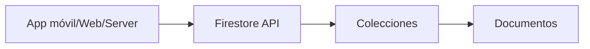

# Firestore en Google Cloud
> **Resumen en una frase:** Firestore es una base de datos **NoSQL**, **escalable horizontalmente**, orientada a documentos, ideal para apps móviles, web y backend, con sincronización en tiempo real, modo offline y transacciones reales.

## 1) Analogía sencilla (Feynman)
Imagina un **archivador inteligente**:
- Cada **documento** es una ficha con pares clave‑valor.
- Las **colecciones** agrupan documentos.
- Cada documento puede tener **subcolecciones** internas.
- Puedes consultar fácilmente “todas las fichas donde apellido = García” sin leer todo el archivador.

## 2) ¿Qué es Firestore?
- Base de datos **NoSQL orientada a documentos**.
- Escala **horizontalmente**.
- Optimizada para **apps móviles, web y backend**.
- Estructuras flexibles con objetos anidados.

## 3) Modelo de datos
- **Documentos** → pares clave‑valor.
- **Colecciones** → conjuntos de documentos.
- **Subcolecciones** → colecciones dentro de un documento.
- Soporta estructuras complejas.

Ejemplo de documento:

```
{
  "firstname": "Ana",
  "lastname": "Ramírez",
  "roles": ["admin", "editor"]
}
```


## 4) Consultas NoSQL
- Consultar un documento específico.
- Consultar documentos en una colección usando filtros.
- Filtros encadenados y ordenamientos.
- **Indexación por defecto** → velocidad proporcional al tamaño del **resultado**, no del dataset.

## 5) Sincronización y modo offline
- Sincronización en tiempo real entre clientes.
- Modo **offline**:
  - Lectura/escritura sin conexión.
  - Cache local de datos usados.
  - Al reconectar, sincroniza cambios.

## 6) Características avanzadas
- Replicación **multi‑región automática**.
- **Consistencia fuerte**.
- Operaciones atómicas.
- Transacciones reales.
- Escalabilidad para millones de usuarios.

## 7) Diagrama conceptual


## 8) Casos de uso
- Apps móviles con sincronización tiempo real.
- Chats y apps colaborativas.
- Apps web con necesidad de caching y modo offline.
- Sistemas con esquemas flexibles.

## 9) Preguntas Feynman
1. ¿Qué diferencia a Firestore de una base relacional?  
2. ¿Por qué las consultas escalan con el tamaño del **resultado**?  
3. ¿Qué ventajas trae el modo offline?  
4. ¿Cómo se estructura la información?

## 10) Tarjetas Anki
**Q:** ¿Qué tipo de base es Firestore?  **A:** NoSQL orientada a documentos.

**Q:** ¿Cómo se organizan los datos?  **A:** Documentos → Colecciones → Subcolecciones.

**Q:** ¿Qué ventaja ofrece el indexado automático?  **A:** Las consultas dependen del tamaño del resultado.

**Q:** ¿Soporta modo offline?  **A:** Sí, con cache local y sincronización al reconectar.

---
### Registro personal
- Firestore sobresale en aplicaciones distribuidas y móviles.
- Su modelo de indexación lo hace ideal para consultas eficientes.
