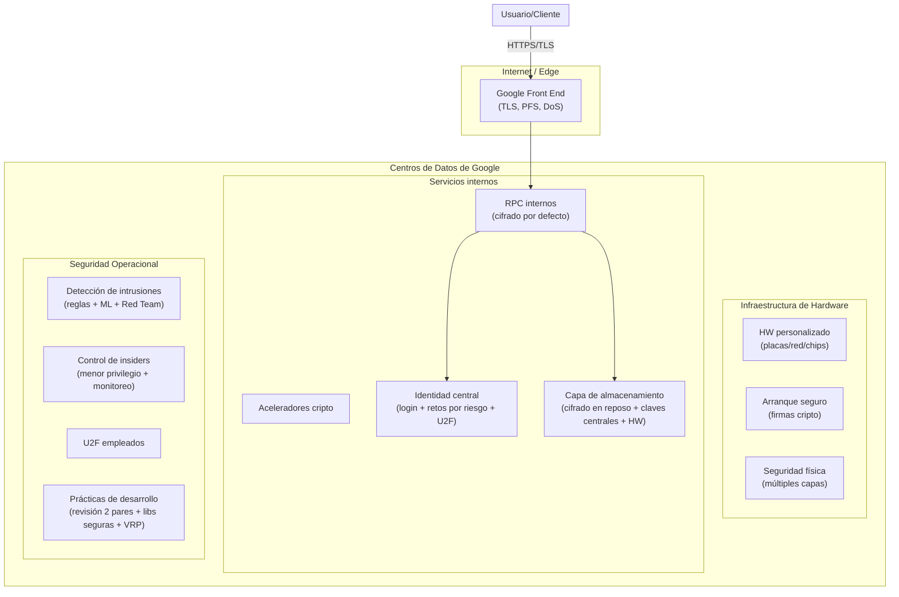
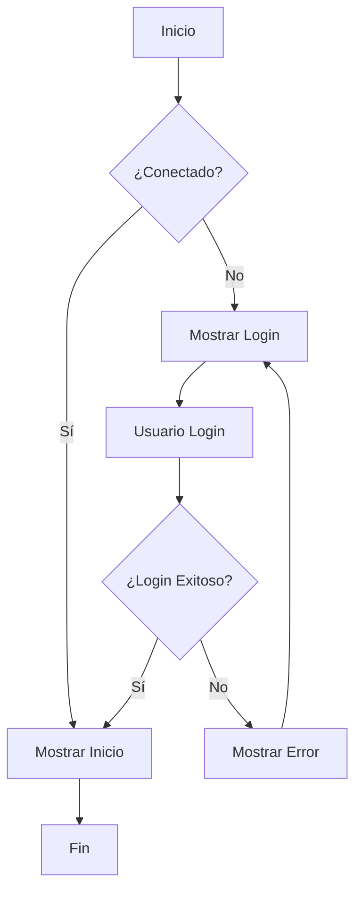

****# Seguridad de la infraestructura técnica de Google Cloud (diseño en capas)
> **Resumen en una frase**: La seguridad de Google Cloud está diseñada en capas que abarcan desde el hardware y los centros de datos hasta la identidad, el cifrado en tránsito y en reposo, la comunicación por Internet y las operaciones internas, para proteger los datos de los clientes de extremo a extremo.

## 1) Analogía sencilla (técnica de Feynman)
Imagina un aeropuerto muy seguro:
- **Hardware/instalaciones** = la infraestructura física del aeropuerto: pistas, terminales, controles de acceso y cámaras.
- **Despliegue de servicios** = pasillos exclusivos por donde solo se mueven aviones y personal acreditado; la comunicación entre torres y aviones va **cifrada**.
- **Identidad de usuarios** = el control de pasaportes que pide documentos y, si algo no cuadra, hace **verificaciones adicionales** (factor de riesgo) y hasta **doble factor**.
- **Almacenamiento** = las maletas en bóvedas **cerradas con llave (cifrado en reposo)**, incluso con cerraduras en el propio candado (cifrado en hardware).
- **Comunicación por Internet (GFE)** = mostradores frontales que **terminan TLS** y siguen buenas prácticas como **PFS**; además, tienen barreras anti-aglomeraciones (**protección DoS**).
- **Seguridad operativa** = equipos que monitorean con reglas e IA, hacen **simulacros de intrusión (Red Team)**, limitan accesos de empleados, exigen **U2F**, y aplican **revisión de código** y programas de recompensas por vulnerabilidades.

## 2) ¿Cuándo usarlo?
- Cuando almacenas o procesas datos sensibles y necesitas **defensa en profundidad**.
- Cuando tus servicios se comunican entre **centros de datos distintos** y quieres **cifrado automático** en tránsito.
- Cuando deseas **autenticación adaptativa** (según riesgo) y **2FA/U2F** para usuarios y empleados.
- Cuando requieres **cifrado en reposo** con **claves gestionadas centralmente** y soporte de **cifrado en hardware**.
- Cuando publicas servicios a Internet y necesitas **terminación TLS, PFS y mitigación DoS**.
- Cuando valoras operaciones maduras: **detección de intrusiones**, **Red Team**, **menor privilegio** y **rev. de código**.

## 3) Arquitectura mínima (visión por capas)
A continuación, un esquema simplificado de cómo se conectan las capas de seguridad en GCP.

> **Región/VPC**: Aunque estas capacidades son transversales, la **terminación TLS** y mitigación DoS ocurren en el borde (GFE), el **cifrado de RPC** protege tráfico **entre** y **dentro** de centros de datos, y el **cifrado en reposo** aplica en las capas de almacenamiento gestionadas. La seguridad física limita el acceso a un **grupo mínimo** de empleados y añade controles extra cuando se usan **terceros data centers**.

## 4) Pasos rápidos (modo "enseña a un novato")
1. **Describe las capas** de abajo hacia arriba (hardware → servicios internos → identidad → almacenamiento → Internet/GFE → operaciones). 
2. **Cuenta la historia** del dato: desde que entra por GFE (TLS/PFS y protección DoS), viaja como **RPC cifrado**, se guarda **cifrado en reposo**, y solo **identidades** validadas acceden.
3. **Cierra el círculo operativo**: explica monitoreo, Red Team, U2F para empleados, menor privilegio y revisión de código.

## 5) CLI / Infra as Code
> Este tema es **conceptual** (diseño de seguridad de la infraestructura). No requiere comandos específicos, pero puedes mapearlo a controles de tu organización (p. ej., exigir 2FA/U2F, políticas de acceso mínimo, y auditorías de código).

## 6) Equivalentes en otras nubes (alto nivel)
- **AWS**: defensa en profundidad (TLS en ELB/CloudFront, KMS, Nitro/arranque seguro, Shield/DoS, IAM + MFA, SDLC seguro).
- **Azure**: Front Door/DoS, Storage encryption, Managed HSM/Keys, AAD con MFA y evaluación de riesgo, prácticas de ingeniería segura.

## 7) Buenas prácticas (Do/Don't)
**Do**
- Aplicar **cifrado en tránsito** (TLS) y **en reposo**.
- Usar **autenticación fuerte** (U2F/2FA) y **evaluación de riesgo**.
- Mantener **menor privilegio**, monitoreo y **auditorías**.
- Ejecutar **ejercicios de Red Team** y programas de **divulgación responsable**.

**Don't**
- Confiar solo en contraseñas o en un único control.
- Omitir la **verificación de integridad de arranque** del sistema.
- Dar accesos amplios sin monitoreo ni trazabilidad.

## 8) Seguridad e IAM
- **Identidades**: servicio central que **reta** al usuario según riesgo (dispositivo/ubicación) y soporta **U2F**.
- **Entre servicios**: RPC cifrado por defecto, con **aceleradores criptográficos** en despliegue.
- **Acceso interno**: accesos administrativos **limitados y monitoreados**.

## 9) Costos y límites
Este diseño es parte de la **infraestructura de Google**. Para el usuario, se refleja en controles disponibles y en el **posture** de seguridad por defecto de los servicios gestionados.

## 10) Observabilidad
- **Detección**: reglas + **inteligencia de máquina** para alertar de incidentes.
- **Pruebas reales**: **Red Team** continuo para medir y mejorar detección y respuesta.

## 11) Troubleshooting rápido (pensamiento Feynman)
- Si algo no te cuadra, **intenta explicarlo a un profe de secundaria** en 3–4 frases: ¿Qué capa protege qué y cómo lo sabrías?
- Dibuja las **capas** y marca dónde están **TLS, RPC cifrado, cifrado en reposo, U2F, DoS**.

## 12) Ejemplo práctico (mini)
- Un usuario entra por **GFE** → la conexión termina en **TLS con PFS** → el servicio A llama al B por **RPC cifrado** → los datos se guardan en un servicio de almacenamiento con **cifrado en reposo** y **claves centrales** → solo usuarios verificados con **retos por riesgo/U2F** pueden acceder → los equipos de seguridad **monitorean** y hacen **Red Team**.

## 13) Preguntas tipo examen / Feynman check
- ¿Qué tres elementos componen la **capa de hardware**?
- ¿Qué significa **cifrar RPC** y dónde aplica?
- ¿Cómo **evalúa riesgos** la identidad central y qué **factor adicional** puede pedir?
- ¿Cuál es la diferencia entre **TLS en GFE** y **cifrado en reposo**?
- ¿Qué actividades conforman la **seguridad operativa** (menciona al menos 3)?

## 14) Tarjetas Anki
Q: ¿En una frase, qué es el **diseño en capas** de seguridad de Google Cloud?
A: Un enfoque de defensa en profundidad desde el hardware y centros de datos hasta identidad, cifrado, frontales de Internet (GFE) y operaciones.

Q: ¿Tres controles clave en la **capa de hardware**?
A: Diseño/procedencia del hardware, **arranque seguro** con firmas criptográficas, y **seguridad física** en data centers.

Q: ¿Qué asegura el **GFE**?
A: Terminación **TLS** con **PFS** y **protección ante DoS**.

Q: ¿Qué protege el **cifrado de RPC**?
A: La **privacidad e integridad** de llamadas entre servicios, entre y dentro de centros de datos.

Q: ¿Qué prácticas fortalecen la **seguridad operativa**?
A: Detección con reglas/ML, **Red Team**, control de insiders, **U2F para empleados**, revisión de código y **Vulnerability Rewards Program**.

## 15) Glosario
- **PFS (Perfect Forward Secrecy)**: propiedad de TLS que evita que comprometer una clave a futuro exponga sesiones pasadas.
- **U2F**: estándar abierto de **segundo factor** basado en hardware (llave de seguridad).
- **RPC**: llamadas entre procesos/servicios para comunicarse dentro de la infraestructura.
- **Red Team**: equipo que simula ataques reales para validar la defensa y la respuesta.

## 16) Referencias
- Doc oficial: https://cloud.google.com/security/security-design
- Fuente base: transcripción proporcionada por el usuario

---
### Registro personal (aprendizajes/notas)
- Lección 1: Identificar **qué capa** cubre cada control evita superponer medidas innecesarias.
- Lección 2: Explicar el **camino del dato** (GFE → RPC → almacenamiento) ayuda a detectar huecos.
- Siguientes pasos: Redactar una **checklist** de validación por capa para mis proyectos en GCP.

hola