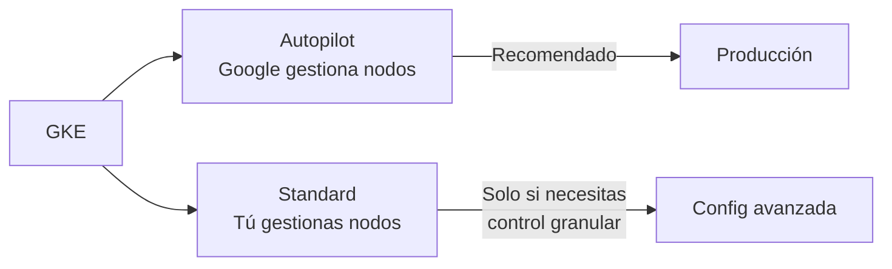
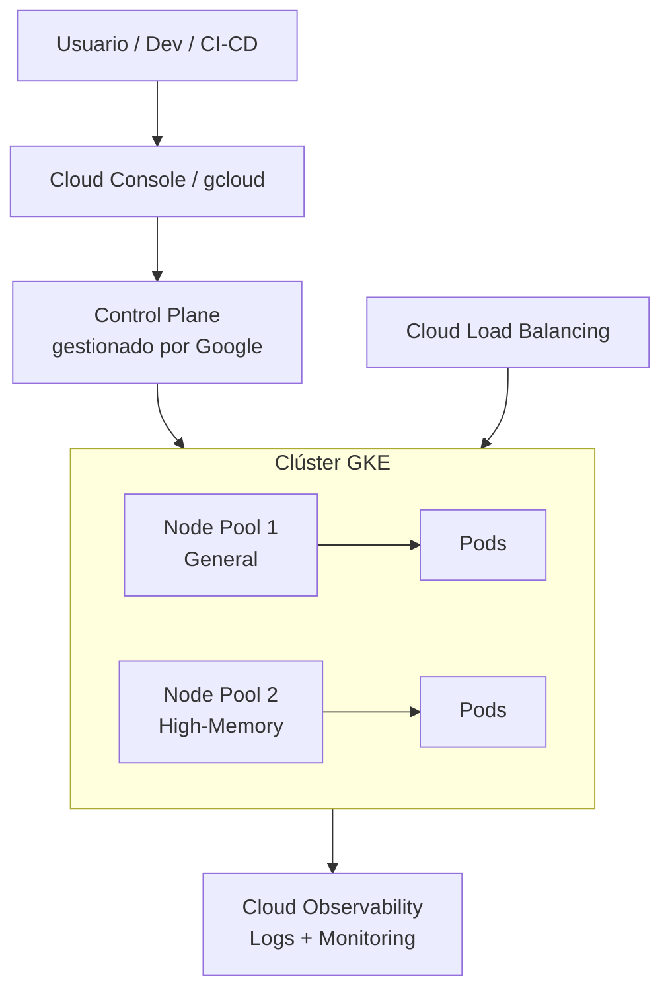

# Google Kubernetes Engine (GKE) en Google Cloud
> **Resumen en una frase:** GKE es el servicio gestionado de Kubernetes en Google Cloud: elimina la gestión del control plane, automatiza nodos, seguridad y red, y permite crear clústeres productivos con un solo comando.

---

## 1) Analogía sencilla (Feynman)
Kubernetes es como el **motor de un auto de Fórmula 1**: muy poderoso, pero requiere un equipo técnico experto para mantenerlo, ajustarlo y operarlo.

**GKE** es como contratar a **Ferrari como tu equipo técnico completo**:
- Ellos mantienen el motor (control plane).
- Tú solo decides a qué velocidad correr (cargas de trabajo).
- En modo **Autopilot**, ni siquiera tienes que preocuparte por los neumáticos (nodos): Ferrari los gestiona por ti.
- En modo **Standard**, tienes acceso al garaje y puedes ajustar todo tú mismo, pero la responsabilidad es tuya.

---

## 2) ¿Qué es GKE?
- Servicio de Kubernetes **totalmente gestionado** por Google en la nube.
- El entorno consiste en múltiples instancias de **Compute Engine** agrupadas en un **clúster**.
- Google gestiona todo el **control plane**: aprovisionamiento, infraestructura y mantenimiento.
- Expone una **IP** a la que se envían todas las solicitudes de la API de Kubernetes.
- Se crea mediante **Google Cloud Console** o con `gcloud`.

---

## 3) GKE vs. Kubernetes puro

| Aspecto | Kubernetes (puro) | GKE |
|--------|-------------------|-----|
| Control plane | Tú lo configuras y mantienes | Google lo gestiona completamente |
| Nodos | Tú los aprovisiones | Gestionados (Autopilot) o configurables (Standard) |
| Actualizaciones | Manuales | Automáticas |
| Complejidad operativa | Alta | Baja (especialmente en Autopilot) |
| Ideal para | On-prem / control total | Producción en GCP |

---

## 4) Modos de GKE: Autopilot vs. Standard

### ⭐ Autopilot (recomendado)
Google gestiona **toda** la infraestructura subyacente:
- Configuración de nodos.
- Autoscaling automático.
- Auto-upgrades del software de nodos.
- Configuración base de seguridad.
- Configuración base de red.

Optimizado para **producción**, seguridad y eficiencia operativa. Es la opción recomendada salvo que necesites control granular.

### 🔧 Standard
- Misma funcionalidad que Autopilot.
- Tú eres responsable de **configurar, gestionar y optimizar** el clúster y sus nodos.
- Úsalo solo si necesitas un nivel específico de control que Autopilot no permite.



---

## 5) Beneficios y funcionalidades avanzadas de GKE

| Funcionalidad | Descripción |
|--------------|-------------|
| **Load Balancing** | Integrado con Cloud Load Balancing para instancias de Compute Engine |
| **Node Pools** | Subconjuntos de nodos dentro del clúster para mayor flexibilidad |
| **Autoscaling** | Escala automáticamente el número de instancias de nodos |
| **Auto-upgrades** | Actualiza automáticamente el software de los nodos |
| **Node auto-repair** | Detecta y repara nodos no saludables automáticamente |
| **Logging & Monitoring** | Integrado con **Google Cloud Observability** para visibilidad completa |

---

## 6) Crear un clúster GKE

```bash
# Crear un clúster llamado k1
gcloud container clusters create k1
```

Con este único comando, GKE:
1. Aprovisiona las VMs (Compute Engine) como nodos.
2. Configura el control plane.
3. Deja el clúster listo para recibir cargas de trabajo.

También se puede crear desde **Google Cloud Console** con opciones de personalización: tipo de máquina, número de nodos, configuración de red, etc.

---

## 7) Diagrama general de GKE



---

## 8) Preguntas Feynman
1. ¿Qué diferencia hay entre GKE y Kubernetes puro en términos operativos?
2. ¿Cuándo elegirías Standard sobre Autopilot?
3. ¿Qué hace Google cuando usas Autopilot que tú harías en Standard?
4. ¿Para qué sirven los Node Pools?
5. ¿Qué pasa internamente cuando ejecutas `gcloud container clusters create k1`?

---

## 9) Tarjetas Anki
**Q:** ¿Qué es GKE?  
**A:** Servicio de Kubernetes totalmente gestionado por Google en GCP, basado en instancias de Compute Engine.

**Q:** ¿Qué gestiona Google en GKE vs. Kubernetes puro?  
**A:** El control plane completo: aprovisionamiento, mantenimiento e infraestructura.

**Q:** ¿Qué modo de GKE gestiona nodos, autoscaling y seguridad automáticamente?  
**A:** Autopilot (recomendado para producción).

**Q:** ¿Qué son los Node Pools en GKE?  
**A:** Subconjuntos de nodos dentro de un clúster con configuraciones distintas para mayor flexibilidad.

**Q:** ¿Cómo se crea un clúster GKE desde la terminal?  
**A:** `gcloud container clusters create <nombre>`

**Q:** ¿Qué servicio provee visibilidad de logs y métricas en GKE?  
**A:** Google Cloud Observability.

---

### Registro personal
- En proyectos nuevos, **siempre empezar con Autopilot**: reduce la carga operativa y es la opción recomendada por Google.
- GKE es la pieza que conecta Kubernetes con todo el ecosistema de GCP (Load Balancing, IAM, Observability, Networking).
- Próximo paso: explorar **Cloud Run** como alternativa serverless a GKE para contenedores sin gestión de clústeres → [[cloud_run_intro]].
