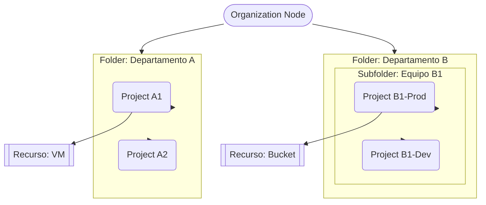

# Jerarquía de recursos en Google Cloud (GCP)
> **Resumen en una frase**: La jerarquía funcional de GCP tiene **cuatro niveles** —**Recursos → Proyectos → Carpetas → Organización**— y las **políticas** pueden aplicarse en varios niveles e **heredarse hacia abajo**. 

## 1) Analogía sencilla (técnica de Feynman)
Piensa en una **universidad**:
- **Organización** = la universidad completa.
- **Carpetas (Folders)** = las facultades (Ingeniería, Artes), que pueden tener **subfacultades**.
- **Proyectos** = los cursos; cada curso maneja su **presupuesto, equipo docente y alumnos** por separado.
- **Recursos** = lo que se usa en cada curso: aulas, laboratorios, bibliografía; en GCP serían **VMs, buckets, tablas de BigQuery, etc.**
Las **normas** (políticas) que pones en la **facultad** se **heredan** a todos sus cursos; puedes tener **excepciones** puntuales en un curso o incluso en un recurso si el servicio lo permite.

## 2) ¿Cuándo usarla?
- Al diseñar **gobernanza/IAM**, **facturación** y **aislamiento** por equipos o entornos.
- Para definir **políticas** (p.ej., restricción de servicios, ubicaciones, etiquetas obligatorias) en **Organización/Carpeta** y **heredarlas** a muchos proyectos.
- Para **delegar administración** por dominios (equipos/departamentos) con **carpetas**.

## 3) Arquitectura mínima (diagrama de jerarquía)

> Las **políticas** definidas en **Organización**, **Carpeta** o **Proyecto** **bajan** a sus **hijos**; algunos servicios permiten políticas también a **nivel de recurso**.

## 4) Contenido clave (resumen del material)
- **Niveles (de abajo hacia arriba)**: **Recursos → Proyectos → Carpetas → Organización**.
- **Recursos**: VMs, buckets de Cloud Storage, tablas de BigQuery, etc.
- **Proyectos**: habilitan y usan servicios (APIs), manejo de **billing**, colaboradores; **cada recurso pertenece a un único proyecto**; los proyectos son entidades separadas con dueños/usuarios propios.
- **Identificadores del proyecto**: 
  - **Project ID**: único global e **inmutable** tras creación.
  - **Project name**: definido por el usuario, **no único** y **cambiable**.
  - **Project number**: generado por Google, usado principalmente **de forma interna**.
- **Resource Manager**: API para **listar/crear/actualizar/eliminar** proyectos; puede **recuperar** proyectos borrados; accesible vía **RPC y REST**.
- **Carpetas**: agrupan proyectos y/o **subcarpetas**; permiten **delegar administración** y **heredar políticas** a sus contenidos.
- **Organización**: nodo raíz que contiene todo; roles especiales como **Organization Policy Admin** y **Project Creator** para controlar políticas y creación de proyectos/costos.
- **Creación del nodo Organización**: 
  - Si tienes **Google Workspace**: los proyectos pertenecen automáticamente a la organización.
  - Si no, puedes usar **Cloud Identity** para generar el nodo.

## 5) Ejemplo práctico (mini)
- Crea **Folder "DataScience"** bajo la Organización.
- Dentro, crea **Proyectos**: `ds-prod`, `ds-dev`.
- Aplica en la **Carpeta**: política que **prohíba** regiones fuera de tu país + etiquetas obligatorias `owner`, `cost_center`.
- Los proyectos **heredan** estas políticas automáticamente; sólo gestionas **excepciones** puntuales.

## 6) Preguntas Feynman (auto-chequeo)
1. ¿Cuáles son los **cuatro niveles** y cómo se relacionan?
2. ¿Qué se **hereda** cuando aplicas una política en **Carpeta**?
3. Diferencia entre **Project ID**, **Project name** y **Project number**.
4. ¿Para qué sirve **Resource Manager** y por qué es útil en automatización?
5. ¿Qué necesitas para usar **Carpetas**?

## 7) Tarjetas Anki
Q: Orden de la jerarquía de GCP.  
A: **Recursos → Proyectos → Carpetas → Organización**.

Q: ¿Dónde se pueden definir políticas y cómo viajan?  
A: En **Proyecto/Carpeta/Organización** (y a veces **Recurso**); se **heredan hacia abajo**.

Q: Tres atributos de un proyecto.  
A: **Project ID (único, inmutable)**, **Project name (no único, editable)**, **Project number (único, interno)**.

Q: ¿Qué hace Resource Manager?  
A: **Gestiona proyectos** por API (listar, crear, actualizar, borrar, recuperar) vía **RPC/REST**.

Q: Requisito para usar carpetas.  
A: Tener un **Organization node**.

## 8) Glosario
- **Organization node**: raíz de todos los recursos de una compañía en GCP.
- **Folder**: contenedor lógico para agrupar proyectos y heredar políticas.
- **Project**: unidad de trabajo y facturación; contenedor de recursos.
- **Resource Manager**: API para administrar proyectos a escala.
- **Herencia de políticas**: propagación automática de políticas desde un nodo padre a sus hijos.

---
### Registro personal (aprendizajes/notas)
- Lección 1: Modelar **departamentos/equipos** con **Carpetas** simplifica la gobernanza.
- Lección 2: Definir políticas en **Organización/Carpeta** reduce **duplicidad** y **errores**.
- Siguientes pasos: Crear un **mapa de carpetas y proyectos** para mis iniciativas de datos.
