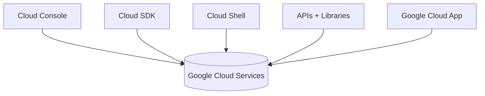

# Interactuando con Google Cloud
> **Resumen en una frase**: Existen cuatro formas principales de interactuar con Google Cloud: **Cloud Console**, **Cloud SDK/Cloud Shell**, **APIs con client libraries**, y la **Google Cloud App**.

## 1) Analogía Feynman
Imagina que Google Cloud es una *gran fábrica digital* y tú puedes entrar de cuatro maneras distintas:
- **Puerta principal (Console)** → interfaz gráfica.
- **Puerta de técnicos (Cloud Shell/SDK)** → acceso directo a herramientas.
- **Puerta automatizada (APIs)** → máquinas hablando con la fábrica.
- **Puerta móvil (Cloud App)** → supervisión desde tu celular.

## 2) Cloud Console (GUI)
- Interfaz web para gestionar recursos, ver estado, escalar y depurar.
- Permite buscar recursos rápidamente.
- Ofrece conexión SSH desde el navegador.
- Útil para gestión visual y exploración.

## 3) Cloud SDK y Cloud Shell
### Cloud SDK
- Conjunto de herramientas para administrar recursos.
- Incluye:
  - **gcloud** (CLI principal).
  - **bq** para BigQuery.
- Se instala localmente; herramientas disponibles en el directorio *bin*.

### Cloud Shell
- VM basada en Debian accesible desde el navegador.
- Tiene:
  - **5GB persistentes**.
  - gcloud, bq y utilidades **preinstaladas y autenticadas**.
- Ideal para administración sin configurar nada localmente.

## 4) APIs y Client Libraries
- Todos los servicios de GCP exponen APIs.
- Google Cloud Console incluye **API Explorer** para probarlas.
- Google ofrece **Cloud Client Libraries** en:
  - Java, Python, PHP, C#, Go, Node.js, Ruby, C++.
- Facilitan la autenticación, manejo de errores y llamadas.
→ Relacionado con autenticación e IAM: [[IAM_intro]].

## 5) Google Cloud App (Móvil)
- Permite:
  - Iniciar/detener instancias Compute Engine.
  - Ver logs.
  - Gestionar Cloud SQL.
  - Desplegar/administrar App Engine.
- Muestra métricas (CPU, red, RPS, errores).
- Incluye alertas de billing e incidentes.

## 6) Diagrama comparativo

## 7) Relación con seguridad y organización
- Acceder por cualquiera de estos medios requiere autenticación → IAM participa siempre.  
  → Ver [[IAM_intro]]
- Acceso a recursos depende de la jerarquía → Organización/Carpetas/Proyectos.  
  → Ver [[herarquia_gcp]]
- Todos estos métodos interactúan con los controles de seguridad descritos en la infraestructura.  
  → Ver [[gcp_seguridad_disenio_en_capas]]

## 8) Tarjetas Anki
Q: ¿Cuáles son las 4 formas de interactuar con GCP?  
A: Console, SDK/Cloud Shell, APIs, Cloud App.

Q: Diferencia entre Cloud SDK y Cloud Shell.  
A: El SDK es local; Cloud Shell es una VM en navegador con SDK preconfigurado.

Q: ¿Qué facilita API Explorer?  
A: Probar APIs directamente con autenticación.

## 9) Registro personal
- Observación: Cloud Shell es la forma más rápida para trabajar sin configurar nada.
- Próxima nota sugerida: **Client Libraries en detalle**.
