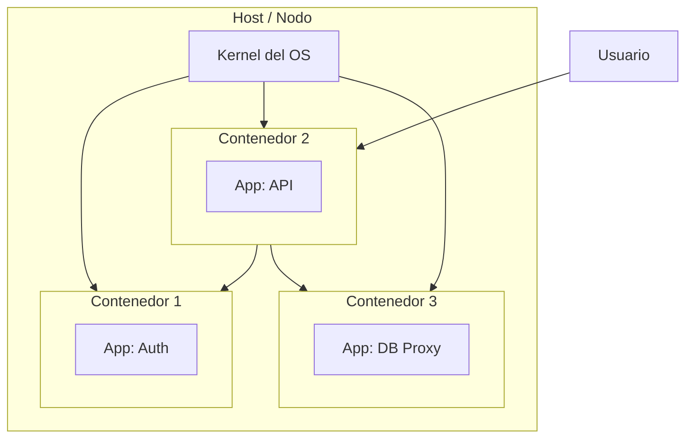

# Introducción a Contenedores, Kubernetes y Orquestación en GCP
> **Resumen en una frase:** Un contenedor es una caja invisible alrededor de tu código y sus dependencias que virtualiza el OS en lugar del hardware, arranca en segundos, escala como PaaS y da la flexibilidad de IaaS.

---

## 1) Analogía sencilla (Feynman)
Imagina que tu aplicación es una **receta de cocina**.

- Con una **VM (IaaS)**, cada cocinero (instancia) necesita su propia **cocina completa** (OS, hardware): tarda en construirse, ocupa mucho espacio y reiniciarla toma minutos.
- Con un **contenedor**, todos los cocineros comparten la misma cocina (kernel del OS), pero cada uno tiene su propia **estación aislada** con sus ingredientes (código + dependencias). Se monta en segundos y ocupa mucho menos espacio.
- Con **Kubernetes**, hay un **jefe de cocina** que decide cuántas estaciones abrir o cerrar según la demanda, las redistribuye si una falla y garantiza que siempre haya suficientes cocineros activos.

---

## 2) Contexto: IaaS, PaaS y el problema de las VMs
Antes de los contenedores, la escala se manejaba con VMs:

| Modelo | Lo que virtualiza | Unidad mínima | Tiempo de arranque |
|--------|------------------|---------------|--------------------|
| **IaaS** | Hardware | VM + OS completo | Minutos |
| **PaaS** | OS y runtime | App | Rápido, pero rígido |
| **Contenedor** | OS (kernel compartido) | Proceso | Segundos |

El problema de IaaS: el **guest OS** puede pesar gigabytes y cada nueva instancia requiere copiar la VM completa. Escalar es lento y costoso.

---

## 3) ¿Qué es un contenedor?
- Una **caja invisible** alrededor del código y sus dependencias.
- Acceso limitado a su partición del sistema de archivos y hardware.
- Solo necesita unas pocas **llamadas al sistema (syscalls)** para crearse.
- Arranca **tan rápido como un proceso**.
- Requiere únicamente un **kernel de OS** con soporte de contenedores y un **container runtime** en el host.

### Propiedades clave
- **Portabilidad total**: mismo contenedor en desarrollo, staging y producción sin cambios.
- **OS y hardware como caja negra**: el desarrollador no depende del entorno subyacente.
- **Escala como PaaS**, flexibilidad casi igual a IaaS.

---

## 4) Escalado con contenedores
Con VMs, escalar una app implica copiar y arrancar una VM entera (minutos).  
Con contenedores, puedes desplegar **docenas o cientos de instancias en segundos** en un solo host.

### Microservicios + contenedores
La arquitectura recomendada es dividir la app en **microservicios**, donde cada contenedor cumple una función específica:

```
[Contenedor: Auth] ←→ [Contenedor: API] ←→ [Contenedor: BD]
```

Ventajas:
- Módulos independientes → despliegue y escala por servicio.
- Comunicación vía red entre contenedores.
- Tolerancia a fallos: si un contenedor falla, los demás siguen operando.

---

## 5) Diagrama conceptual


---

## 6) Preguntas Feynman
1. ¿Por qué un contenedor arranca más rápido que una VM?
2. ¿Qué significa que el OS se "virtualiza" en lugar del hardware?
3. ¿Qué ventaja tiene dividir una app en microservicios contenerizados?
4. ¿Qué necesita un host para ejecutar contenedores?
5. ¿Por qué los contenedores hacen el código "ultra portable"?

---

## 7) Tarjetas Anki
**Q:** ¿Qué virtualiza un contenedor?  
**A:** El sistema operativo (comparte el kernel del host), no el hardware.

**Q:** ¿Cuál es la unidad mínima de cómputo en IaaS?  
**A:** Una app con su VM completa (incluyendo guest OS).

**Q:** ¿Qué necesita un host para ejecutar contenedores?  
**A:** Un kernel de OS con soporte de contenedores + un container runtime.

**Q:** ¿Qué modelo combina la escalabilidad de PaaS con la flexibilidad de IaaS?  
**A:** Los contenedores.

**Q:** ¿Qué arquitectura maximiza las ventajas de los contenedores?  
**A:** Microservicios: cada contenedor cumple una función independiente.

---

### Registro personal
- Los contenedores son la base de toda la arquitectura moderna en GCP (GKE, Cloud Run, etc.).
- La clave es entender que **comparten el kernel**: eso los hace livianos pero también implica que el OS del host importa.
- Próximo paso: ver cómo **Kubernetes** orquesta múltiples contenedores entre múltiples hosts → [[kubernetes_intro]].
