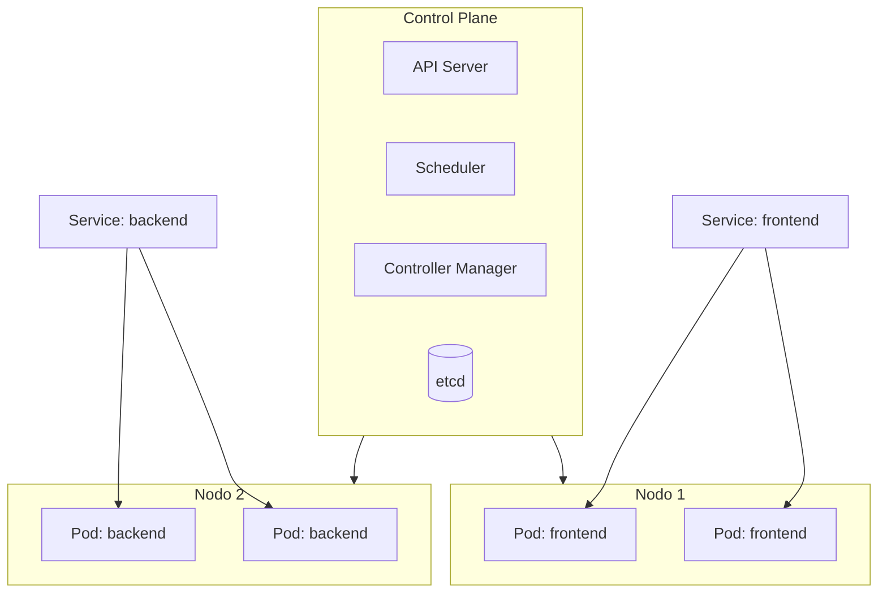
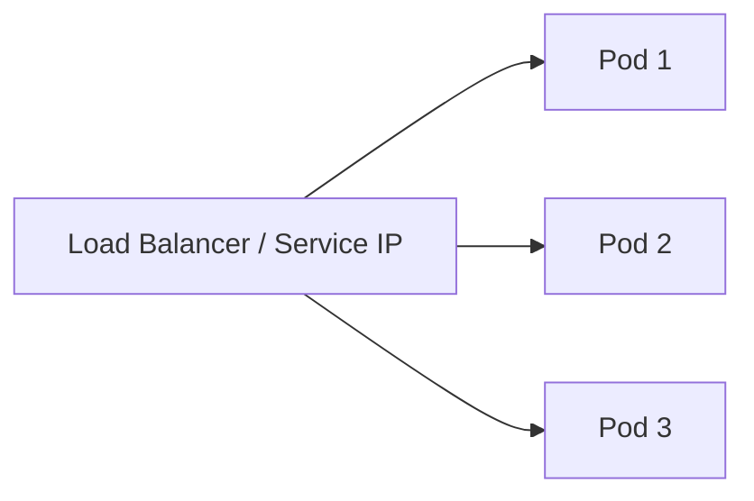

# Kubernetes en Google Cloud
> **Resumen en una frase:** Kubernetes es una plataforma open-source que orquesta contenedores sobre un clúster de nodos, gestionando despliegues, escalado, rollouts y recuperación automática mediante una API declarativa.

---

## 1) Analogía sencilla (Feynman)
Imagina que tienes **100 cocineros (contenedores)** trabajando en varios restaurantes (nodos).

- **Sin Kubernetes**: tú decides manualmente en qué restaurante poner cada cocinero, cuántos contratar si hay más pedidos, y qué hacer si uno cierra.
- **Con Kubernetes**: hay un **director de operaciones** que sabe cuántos cocineros se necesitan, los redistribuye si un restaurante falla, y garantiza que siempre haya suficiente capacidad. Tú solo le dices *qué quieres*, él decide *cómo lograrlo*.

---

## 2) ¿Qué es Kubernetes?
- Plataforma **open-source** para gestionar cargas de trabajo contenerizadas.
- Orquesta contenedores en múltiples hosts (**clúster**).
- Permite desplegar **microservicios**, escalarlos y hacer rollouts/rollbacks fácilmente.
- Expone un conjunto de **APIs** para describir el estado deseado del sistema.
- En GCP se usa a través de **Google Kubernetes Engine (GKE)**, que lo bootstrappea automáticamente.

---

## 3) Arquitectura del clúster

| Componente | Rol |
|-----------|-----|
| **Control Plane** | Cerebro del clúster: recibe instrucciones y coordina nodos |
| **Nodo** | Máquina (VM en GCP sobre Compute Engine) que ejecuta contenedores |
| **Pod** | Unidad mínima desplegable: uno o más contenedores con IP y puertos propios |
| **Deployment** | Grupo de réplicas del mismo Pod; mantiene los Pods activos ante fallos |
| **Service** | IP fija y estable que agrupa Pods y expone un endpoint |

> ⚠️ **Importante**: un *nodo* en Kubernetes es una máquina/instancia de cómputo. En GCP equivale a una VM de Compute Engine, no a un "nodo" en el sentido de GCP.

---

## 4) Objetos clave

### 🔹 Pod
- Unidad mínima creable/desplegable.
- Representa un proceso corriendo en el clúster.
- Generalmente **1 contenedor por Pod**.
- Si hay dependencia fuerte entre contenedores → pueden compartir un Pod (comparten red y almacenamiento).
- Cada Pod tiene una **IP única + set de puertos**.

### 🔹 Deployment
- Agrupa **réplicas idénticas** de un Pod.
- Mantiene los Pods corriendo aunque fallen nodos.
- Puede representar un microservicio o una app completa.

### 🔹 Service
- Abstracción que define un conjunto lógico de Pods + política de acceso.
- Provee una **IP fija** (estable) aunque los Pods cambien.
- En GKE crea un **network load balancer** con IP pública si se expone externamente.

---

## 5) Comandos esenciales

| Acción | Comando |
|--------|---------|
| Crear un Deployment | `kubectl run <nombre> --image=<imagen>` |
| Ver Pods en ejecución | `kubectl get pods` |
| Exponer como Service | `kubectl expose deployment <nombre>` |
| Escalar réplicas | `kubectl scale deployment <nombre> --replicas=N` |
| Ver Deployments | `kubectl get deployments` |
| Detalle de Deployment | `kubectl describe deployments` |
| Ver Services (IPs) | `kubectl get services` |
| Aplicar config declarativa | `kubectl apply -f <archivo.yaml>` |
| Rollout de nueva versión | `kubectl rollout` o `kubectl apply` |

---

## 6) Modo imperativo vs. declarativo

| Modo | ¿Cómo funciona? | ¿Cuándo usarlo? |
|------|----------------|-----------------|
| **Imperativo** | Das comandos paso a paso (`run`, `expose`, `scale`) | Aprendizaje, pruebas rápidas |
| **Declarativo** | Describes el **estado deseado** en un archivo YAML; Kubernetes determina cómo alcanzarlo | Producción, pipelines CI/CD |

> 💡 **La fuerza real de Kubernetes está en el modo declarativo.** Defines *qué quieres*, no *cómo hacerlo*.

---

## 7) Escalado y autoscaling
- **Manual**: `kubectl scale` para definir un número fijo de réplicas.
- **Automático (HPA)**: escala según métricas, por ejemplo CPU > 80% → crear más Pods.

---

## 8) Rollouts y rollbacks
Al actualizar una app, **no se reemplazan todos los Pods de golpe** (riesgoso).  
La estrategia recomendada es **rolling update**:

1. Se crea un nuevo Pod con la versión actualizada.
2. Se espera a que esté disponible (*Ready*).
3. Recién entonces se elimina uno de los Pods viejos.
4. Se repite hasta completar la actualización.

Esto garantiza **cero downtime** durante el despliegue.

---

## 9) Preguntas Feynman
1. ¿Cuál es la diferencia entre un Pod y un Deployment?
2. ¿Por qué un Service tiene IP fija si los Pods pueden cambiar?
3. ¿Qué ventaja tiene el modo declarativo sobre el imperativo?
4. ¿Cómo evita Kubernetes el downtime al actualizar una app?
5. ¿Qué diferencia hay entre un nodo en Kubernetes y un nodo en GCP?

---

## 10) Tarjetas Anki
**Q:** ¿Qué es un Pod?  
**A:** La unidad mínima desplegable en Kubernetes: uno o más contenedores con IP única y puertos propios.

**Q:** ¿Qué es un Deployment?  
**A:** Un grupo de réplicas idénticas de un Pod que mantiene los Pods activos ante fallos de nodos.

**Q:** ¿Para qué sirve un Service?  
**A:** Proveer una IP fija y estable que agrupa Pods y permite accederlos aunque cambien.

**Q:** ¿Qué crea GKE al exponer un Service externamente?  
**A:** Un network load balancer con IP pública.

**Q:** ¿Qué estrategia de despliegue evita downtime?  
**A:** Rolling update: crea el Pod nuevo, espera que esté listo y luego elimina uno viejo.

**Q:** ¿Cuál es la diferencia entre modo imperativo y declarativo?  
**A:** Imperativo: comandos paso a paso. Declarativo: defines el estado deseado en YAML y Kubernetes lo alcanza solo.

---

### Registro personal
- La clave de Kubernetes es pensar en **estado deseado**, no en pasos.
- Services desacoplan frontend y backend: cada uno se actualiza sin afectar al otro.
- Próximo paso: profundizar en **GKE** (Google Kubernetes Engine) como implementación gestionada → [[gke_intro]].
