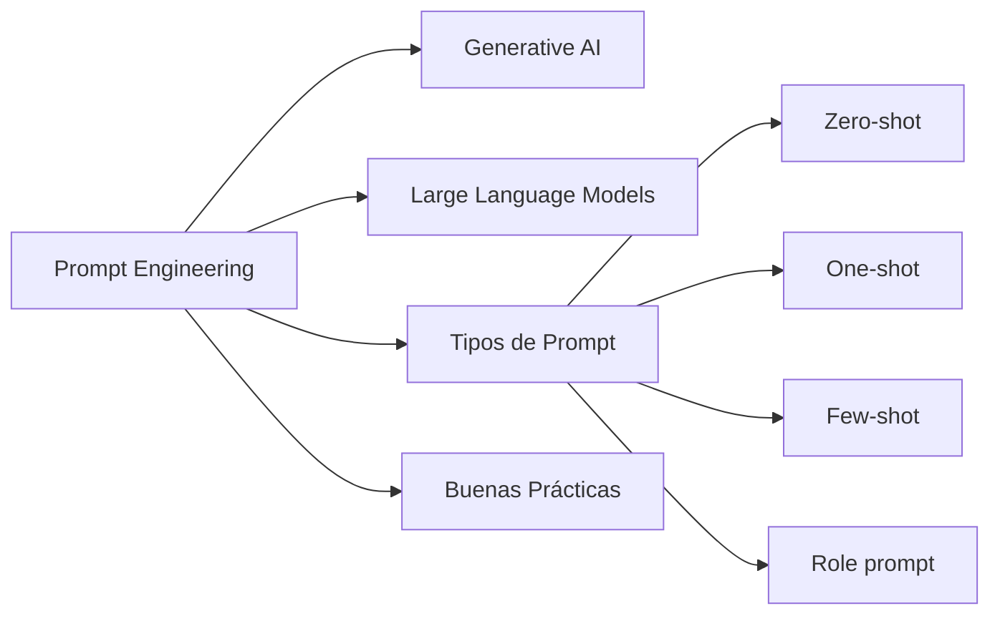

# Prompt Engineering: Fundamentos y Buenas Prácticas
> **Resumen en una frase:** Prompt engineering es el arte de estructurar instrucciones para extraer las respuestas más útiles de un LLM, entendiendo cómo funciona el modelo y qué tipos de contexto lo guían mejor.

---

## 1) Mapa conceptual del módulo



---

## 2) Analogía sencilla (Feynman)

Un LLM es como un **colega muy leído pero sin memoria ni acceso a internet**:
- Ha leído millones de libros (datos de entrenamiento).
- Solo sabe lo que leyó: no conoce tu empresa, tus datos ni lo que pasó ayer.
- Responde basándose en **probabilidad**: dice lo que "más probablemente" es correcto según lo que aprendió.
- Si le haces una pregunta vaga, te da una respuesta vaga. Si le das contexto, enfoca su respuesta.

**Prompt engineering** es aprender a hablarle bien a ese colega para que te dé respuestas útiles.

---

## 3) Conceptos base

### Generative AI (Gen AI)
- Subconjunto de IA capaz de generar **texto, imágenes u otros datos** a partir de prompts.
- Aprende patrones y estructura desde datos de entrenamiento y genera contenido nuevo con características similares.
- Usos: desarrollo de software, salud, finanzas, entretenimiento, servicio al cliente.

### Large Language Models (LLMs)
- Modelos de propósito general, pre-entrenados en datasets masivos (escala de **petabytes**).
- **"Large"** se refiere a:
  - Tamaño del dataset de entrenamiento.
  - Número de **parámetros** (memorias y conocimientos aprendidos; pueden llegar a billones).
- Flujo: **pre-entrenamiento** (dataset enorme, propósito general) → **fine-tuning** (dataset pequeño, tarea específica).
- Funcionan como un **autocomplete sofisticado**: calculan la probabilidad de la respuesta más correcta.

### ¿Qué es un prompt?
Instrucción, pregunta o señal específica que le das al modelo para iniciar una acción o respuesta.

---

## 4) Alucinaciones (Hallucinations)

Un LLM puede generar respuestas **incorrectas o sin sentido** con total confianza. Esto se llama alucinación.

### ¿Por qué ocurre?
- El modelo no fue entrenado con suficientes datos.
- Fue entrenado con datos ruidosos o sucios.
- El prompt no da suficiente contexto.
- El prompt no tiene suficientes restricciones.

### Limitaciones estructurales de los LLMs
- Solo conocen lo que estaba en su dataset de entrenamiento.
- **No tienen acceso a información en tiempo real.**
- No conocen datos propietarios o específicos de tu empresa.
- Asumen que el prompt es verdadero y no pueden pedir más contexto.
- No saben si su información es actualmente correcta.

> 💡 Un buen prompt engineering reduce significativamente el riesgo de alucinaciones.

---

## 5) Tipos de prompts

### 🔹 Zero-shot
Sin ejemplos ni contexto adicional. Solo la pregunta directa.
```
¿Cuál es la capital de Francia?
```
Funciona bien para preguntas generales. Para tareas técnicas o específicas, es insuficiente.

---

### 🔹 One-shot
Se proporciona **un ejemplo** para guiar al modelo.
```
Italia tiene como capital Roma.
¿Cuál es la capital de Francia?
```

---

### 🔹 Few-shot
Se proporcionan **dos o más ejemplos** para dar más contexto.
```
Italia tiene como capital Roma.
Japón tiene como capital Tokio.
¿Cuál es la capital de Francia?
```
Más útil cuanto más técnica o específica sea la tarea.

---

### 🔹 Role prompt
Se le asigna al modelo un **rol o persona** como marco de referencia.
```
Quiero que actúes como un profesor de negocios.
Te daré un término y deberás explicar su significado correctamente.
Asegúrate de que tus respuestas siempre sean correctas.
¿Qué es el ROI?
```
Ideal para tareas técnicas: el rol concentra el "foco" del modelo en el dominio relevante.

---

## 6) Estructura de un prompt: Preámbulo + Input

| Elemento | Qué es | Ejemplo |
|----------|--------|---------|
| **Preámbulo** | Texto introductorio con contexto, instrucciones y ejemplos. "Prepara el escenario" | *"Eres un arquitecto cloud. Quieres construir una VPC en GCP..."* |
| **Input** | La solicitud o tarea central sobre la que actúa el preámbulo | *"¿Qué arquitectura de red recomendarías?"* |

> No todos los componentes son obligatorios y el orden puede variar según la tarea.

---

## 7) Ejemplo práctico: evolución de un prompt

**Prompt inicial (vago):**
```
¿Cómo puedo crear una red que use direcciones IPv4 e IPv6?
```

**Prompt mejorado (con rol + contexto + tarea específica):**
```
Quiero que actúes como arquitecto cloud en Google Cloud.
¿Cómo puedo usar gcloud para crear una red con subredes IPv4 e IPv6 (dual stack)?
```

**Prompt optimizado (rol + contexto + restricciones + objetivo claro):**
```
Eres un arquitecto cloud. Quieres construir una VPC en Google Cloud que pueda
administrarse centralmente. También necesitas conectarla a otras VPCs en otras
regiones de tu empresa. No quieres mantener múltiples conjuntos de políticas
de firewall. ¿Qué arquitectura de red recomendarías?
```
→ Resultado: Gemini propone una arquitectura **hub-and-spoke**, que es exactamente la solución correcta.

---

## 8) Buenas prácticas de Prompt Engineering

### ✅ 1. Instrucciones detalladas y explícitas
Mientras más vago el prompt, más genérica (e inútil) será la respuesta. Sé claro y conciso.

### ✅ 2. Define límites y restricciones
Dile al modelo qué **hacer**, no qué evitar. Si puede quedar bloqueado, dale salidas predeterminadas.
```
Si no tienes suficiente información, responde: "Aún estoy aprendiendo sobre eso."
```

### ✅ 3. Adopta una persona o rol
Asignar un rol concentra el foco del modelo en el dominio relevante y mejora la precisión.

### ✅ 4. Frases cortas y tareas simples
Oraciones largas producen resultados subóptimos. Divide un prompt complejo en una serie de instrucciones cortas y secuenciales.

---

## 9) Gemini en Google Cloud
- Modelo de GenAI de Google, embebido en la **consola de GCP**.
- Sin instalación adicional: disponible directamente en el entorno de trabajo.
- Tiene acceso a documentación, tutoriales y samples de Google Cloud.
- Puede generar comandos `gcloud` e insertarlos directamente en Cloud Shell.
- Útil para: architects, data scientists, developers y operadores.

---

## 10) Preguntas Feynman
1. ¿Por qué un LLM puede dar una respuesta incorrecta con total confianza?
2. ¿Qué diferencia hay entre un prompt zero-shot y un few-shot? ¿Cuándo usarías cada uno?
3. ¿Por qué un role prompt mejora la precisión en tareas técnicas?
4. ¿Qué limitación estructural hace que los LLMs no sirvan bien para datos propietarios de una empresa sin RAG o fine-tuning?
5. ¿Cuál es la diferencia entre preámbulo e input en un prompt?

---

## 11) Tarjetas Anki
**Q:** ¿Qué es un LLM?  
**A:** Modelo de lenguaje de propósito general, pre-entrenado en datasets masivos y ajustable (fine-tuning) para tareas específicas.

**Q:** ¿Qué son los parámetros en un LLM?  
**A:** Las memorias y conocimientos que el modelo aprendió durante el entrenamiento; pueden llegar a billones.

**Q:** ¿Qué es una alucinación en un LLM?  
**A:** Respuesta generada por el modelo que es incorrecta, sin sentido o engañosa, producida con aparente confianza.

**Q:** ¿Qué tipo de prompt da dos o más ejemplos al modelo?  
**A:** Few-shot prompt.

**Q:** ¿Cuáles son los dos elementos principales de un prompt?  
**A:** Preámbulo (contexto e instrucciones) e Input (la solicitud central).

**Q:** ¿Qué buena práctica ayuda a evitar que el modelo divague en tareas técnicas?  
**A:** Adoptar una persona o rol que concentre el foco del modelo en el dominio relevante.

---

### Registro personal
- El prompt engineering es directamente aplicable al trabajo con Gemini en GCP y con Claude o Bedrock en AWS.
- Para tareas de analítica o ML: los role prompts + few-shot son la combinación más poderosa.
- Las alucinaciones son el riesgo central en agentes de IA sobre datos de negocio → mitigar con RAG, contexto explícito y restricciones claras.
- Relacionado con la evaluación multi-cloud: `[[gcp_vs_aws_homologacion]]` (Vertex AI Agents vs. Bedrock Agents).
- Continúa en el módulo 04 con la arquitectura completa de Gen AI en Google Cloud y su implementación práctica en Vertex AI Studio: `[[genai_arquitectura_google_cloud]]`, `[[vertex_ai_studio_idea_to_app]]`, `[[vertex_ai_studio_parametros_modelo]]`.
