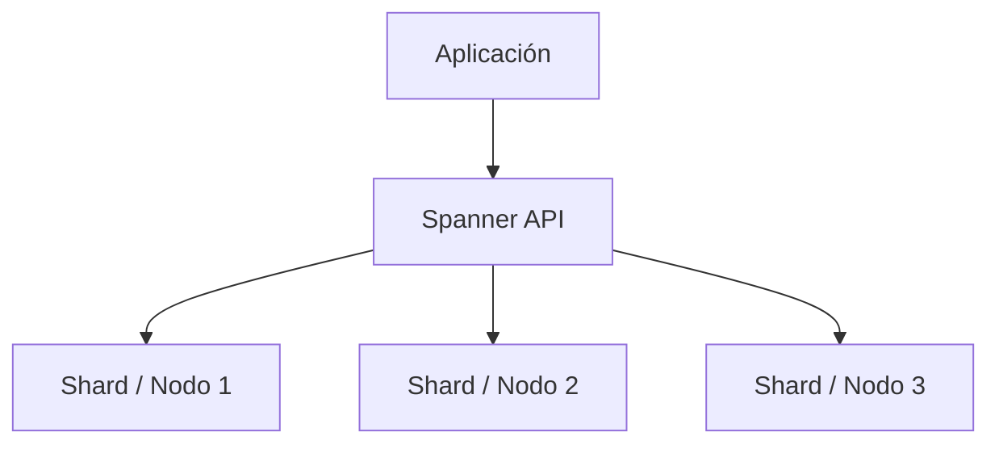

# Cloud Spanner en Google Cloud
> **Resumen en una frase:** Cloud Spanner es una base de datos **relacional distribuida**, **horizontalmente escalable**, **fuertemente consistente**, totalmente gestionada y capaz de manejar **decenas de miles de lecturas/escrituras por segundo**.

## 1) Analogía sencilla (Feynman)
Imagina una **única base de datos gigante**, pero repartida en cientos de edificios (servidores) alrededor del mundo, funcionando como **una sola**. Las transacciones siempre son correctas, sin importar desde dónde leas o escribas. Esa es la magia de Spanner.

## 2) ¿Qué es Spanner?
- Base de datos **relacional** que soporta **SQL**.
- Totalmente **gestionada** por Google.
- Se **escala horizontalmente** (añades nodos y crece sin downtime).
- Es **fuertemente consistente** incluso a escala global.
- Está diseñada para cargas **críticas**, incluyendo aplicaciones internas de Google.

## 3) ¿Por qué es especial?
Spanner combina lo mejor de dos mundos:
- **Bases relacionales tradicionales** → SQL, joins, índices, ACID.
- **Sistemas distribuidos NoSQL** → escalabilidad horizontal + disponibilidad global.

Es la base de datos que respalda aplicaciones del negocio de **más de $80 mil millones** de Google.

## 4) Casos de uso
Ideal cuando necesitas:
- Transacciones ACID **globales**.
- **Joins** y **secundary indexes**.
- **Alta disponibilidad** sin preocuparte por réplicas.
- **Escalamiento masivo** (decenas de miles de IOPS).
- Latencia consistente entre regiones.

## 5) Diagrama conceptual

## 6) Características clave
- **Escalamiento horizontal real**.
- **Consistencia fuerte** a través de regiones.
- **SQL estándar**.
- **Joins** e **índices secundarios**.
- **Alta disponibilidad** automática.
- **IOPS muy altos** (decenas de miles por segundo).

## 7) Preguntas Feynman
1. ¿Por qué Spanner puede escalar horizontalmente sin perder consistencia?  
2. ¿En qué se diferencia de Cloud SQL?  
3. ¿Qué tipo de aplicaciones requieren transacciones globales?  
4. ¿Por qué Google usa Spanner para negocios críticos?

## 8) Tarjetas Anki
**Q:** ¿Qué tipo de base es Spanner?  **A:** Relacional distribuida, totalmente gestionada y fuertemente consistente.

**Q:** ¿Qué motores soporta?  **A:** SQL estándar (no es MySQL/Postgres; es su propio engine distribuido).

**Q:** ¿Qué lo diferencia de Cloud SQL?  **A:** Cloud SQL escala verticalmente; Spanner escala **horizontalmente**.

**Q:** ¿Para qué cargas es ideal?  **A:** Aplicaciones globales y de misión crítica que requieren miles de IOPS.

---
### Registro personal
- Spanner es la base de datos “soñada” para sistemas globales.  
- Cuando un proyecto requiere escalado horizontal **y** SQL, es la opción natural.
