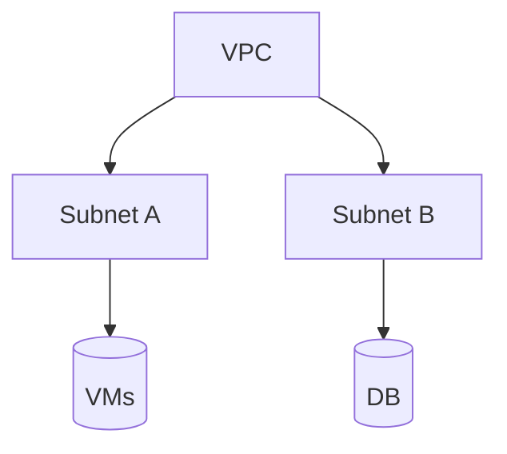

# Virtual Private Cloud Networking
Un VPC es un **modelo de nube privada y segura dentro de la nube pública GCP**.

Cada VPC puede tener **múltiples subnets aisladas** gracias a su definición de rangos IP.
Esto permite alojar servicios independientes aumentando la **resiliencia**.

## Feautures
- Tiene tablas de enrutamiento. Estas permiten enviar tráfico de una instancia a otra en una misma red o entre subnets o incluso entre zonas de google cloud sin requerir IP externa
- No hay que crear el firewall y se pueden generar reglar por medio de etiquetas de red en instancias de compute engine- Por ejemplo, etiquetas todos los servidores con "web" y luego creas una regla de firewall que indique que se permite el tráfico en puertos 80 o 443 a todos los servers con esa misma etiqueta
- - Se puede establecer relaciones entre VPCs con:
	- VPC peering: comunicación entre 2 VPCs
	- Configurar una VPC compartida haciendo uso de IAM para administrar los accesos
## Conceptos claves
- Subnets regionales.
- Comunicación interna por default.
- Firewall rules.
- Rutas.
- Peering, Shared VPC.

→ Relacionado con: Balanceadores, IAM, Proyectos.

## Diagrama

## Tarjetas Anki
Q: ¿Qué es una VPC?  
A: Red privada lógica dentro de GCP.

Q: ¿Qué permite tener subnets aisladas?  
A: Separar recursos y mejorar resiliencia.
