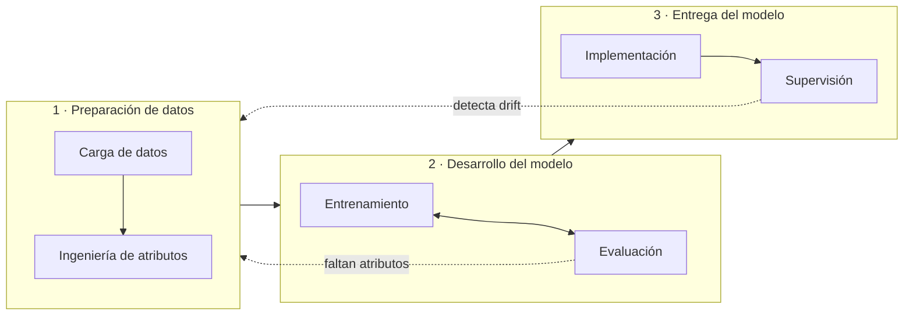

# Flujo de trabajo de ML en Vertex AI y MLOps
> **Resumen en una frase**: Todo modelo en Vertex AI recorre tres etapas —**preparación de datos → desarrollo del modelo → entrega del modelo**— que **no son lineales sino iterativas**, y MLOps es lo que convierte ese recorrido manual en una canalización automatizada capaz de reentrenar y redesplegar sin intervención humana.

## 1) Analogía sencilla (Feynman): el restaurante

El curso usa una analogía que vale la pena conservar entera, porque cada etapa tiene su equivalente exacto:

| Etapa de ML | En el restaurante |
|---|---|
| **Preparación de datos** | Comprar y alistar los ingredientes: pelar zanahorias, picar cebollas, enjuagar tomates |
| **Desarrollo del modelo** | Experimentar con recetas: cocinar, probar, ajustar, volver a cocinar |
| **Entrega del modelo** | Servir el plato al cliente y vigilar que el servicio siga funcionando bien |

Y el remate importante: **si nunca sirves el plato, no tienes un restaurante, tienes un pasatiempo**. Un modelo que no se despliega se queda como modelo teórico, sin uso real.

La analogía también explica por qué el flujo **no es lineal**: si al probar la salsa falta sal, vuelves a la despensa. En ML, si durante el entrenamiento el modelo no rinde, vuelves a los datos crudos a generar más atributos; si en producción ves desviación de datos (*drift*) o cae la exactitud, revisas las fuentes y reajustas.

## 2) Panorama de las tres etapas

Dos formas de recorrerlo, según [[opciones_desarrollo_ml_gcp]]:

- **Sin código**: AutoML desde la consola. No exige experiencia en ML ni saber programar.
- **Con código**: Vertex AI Workbench o Colab, orquestando con **Vertex AI Pipelines**. Es la vía si eres ingeniero de ML o científico de datos y quieres automatizar de forma programática.

## 3) Etapa 1 · Preparación de datos

**Origen de los datos**: Cloud Storage, BigQuery o la máquina local.

Dos ejes que clasifican los datos y que el examen usa como señal:

| Eje | Opciones |
|---|---|
| **Temporalidad** | Transmisión en tiempo real (*streaming*) o por lotes (*batch*) |
| **Estructura** | **Estructurados** (números, texto — caben en tablas) o **no estructurados** (imágenes, video — no caben) |

**Objetivos disponibles para datos tabulares**: regresión, clasificación y **previsión** (*forecasting*).

### Ingeniería de atributos y Feature Store

Un **atributo** (*feature*) es un factor que contribuye a la predicción: una variable independiente, una columna de la tabla. Prepararlos es la parte tediosa, y por eso existe **Vertex AI Feature Store**: un repositorio centralizado para administrar, entregar y compartir atributos, que los agrega desde BigQuery y los sirve en dos modos:

- **En línea** (*online*): tiempo real, baja latencia.
- **Sin conexión** (*offline*): por lotes.

Flujo de la entrega en línea, en cuatro pasos: **preparar** la fuente en BigQuery → **registrar** creando atributos y grupos → **configurar la conexión** con una *feature view* que define qué se copia al almacén en línea → **entregar** los atributos más recientes.

Cuatro beneficios: los atributos se **comparten** entre entrenamiento y entrega (lo que mantiene coherencia y evita el *training-serving skew*), son **reutilizables**, **escalan** solos con baja latencia, y la interfaz es sencilla.

Detalle que ya no es solo de IA predictiva: Feature Store **administra y entrega embeddings** y permite recuperar elementos similares en tiempo real — es decir, sirve de infraestructura para RAG (ver [[vertex_ai_studio_despliegue_y_tuning]]).

## 4) Etapa 2 · Desarrollo del modelo

### Configuración del entrenamiento

1. **Método de entrenamiento**: se elige el dataset cargado, y según el tipo de datos (tabular, imagen, texto o video) se define el **objetivo** — la tarea que se quiere resolver.
2. **AutoML o entrenamiento personalizado**.
3. **Detalles**: para aprendizaje supervisado, la **columna objetivo**; qué atributos incluir y qué transformaciones aplicar.
4. **Presupuesto y precios**, y arrancar.

AutoML entrena y selecciona los de mejor rendimiento entre miles de opciones, con **búsqueda de arquitectura neuronal** y **aprendizaje por transferencia**.

### Evaluación: la matriz de confusión

Medición específica para clasificación, que cruza lo predicho contra lo real:

|  | Realmente positivo | Realmente negativo |
|---|---|---|
| **Predicho positivo** | Verdadero positivo (VP) | **Falso positivo (FP)** — error de tipo I |
| **Predicho negativo** | **Falso negativo (FN)** — error de tipo II | Verdadero negativo (VN) |

De ahí salen las dos métricas centrales:

| Métrica | Fórmula | La pregunta que responde |
|---|---|---|
| **Recuperación** (*recall*) | VP / (VP + FN) | De todos los positivos **reales**, ¿cuántos capturé? |
| **Precisión** (*precision*) | VP / (VP + FP) | De todos los que **predije** positivos, ¿cuántos acerté? |

Y siempre hay un compromiso entre ambas. El ejemplo del curso, con el filtro de spam de Gmail:

- Si el objetivo es **no dejar pasar spam**, priorizas **recuperación** (aceptas bloquear algún correo bueno).
- Si el objetivo es **no bloquear correo legítimo**, priorizas **precisión** (aceptas que se cuele algún spam).

Vertex AI permite visualizar la curva de precisión-recuperación y mover el umbral según el caso.

### Importancia de atributos y Explainable AI

Vertex AI muestra en un gráfico de barras **cuánto aporta cada atributo a la predicción**: a mayor barra, mayor peso. Sirve para decidir qué atributos conservar. Es una manifestación concreta de **Explainable AI**, el conjunto de herramientas de Google Cloud para interpretar y comprender las predicciones de un modelo.

## 5) Etapa 3 · Entrega del modelo

Dos pasos: **implementación** y **supervisión**. Y por encima de todo el flujo, la **administración de modelos**, que gestiona la infraestructura para que el científico de datos se ocupe del *qué* y no del *cómo*.

### Las tres formas de servir predicciones

| Opción | Cómo funciona | Cuándo |
|---|---|---|
| **Predicción en línea** | El modelo se despliega **en un endpoint** | Se necesita respuesta inmediata con baja latencia: recomendaciones según la navegación del usuario |
| **Predicción por lotes** | Se pide el trabajo **directamente al recurso del modelo**; **no requiere endpoint** | No hace falta respuesta inmediata: campañas de marketing cada dos semanas |
| **Perimetral** (*edge*) | El modelo se despliega **fuera de la nube** | Mitigar latencia, garantizar privacidad o funcionar **sin conexión**: detección de objetos con cámara en una fábrica |

> El discriminador examinable: **la predicción en línea exige desplegar en un endpoint; la de por lotes no.**

## 6) MLOps: de un flujo manual a uno automatizado

**MLOps** aplica los principios de DevOps a los modelos de ML. Su razón de ser es que **los datos y el código evolucionan constantemente**, lo que hace que un sistema de ML en producción se degrade solo. Automatizar y supervisar cada paso habilita **integración, entrenamiento y entrega continuos (CI / CT / CD)**.

> El *continuous training* es lo que no existe en DevOps clásico y es exactamente lo que distingue a MLOps: el modelo se reentrena solo cuando los datos cambian.

### Vertex AI Pipelines

Es la base de MLOps en Vertex AI: automatiza, supervisa y controla los sistemas de ML orquestando el flujo **sin servidores**. Soporta dos SDK:

| SDK | Cuándo elegirlo |
|---|---|
| **TFX** (TensorFlow Extended) | Ya usas TensorFlow y procesas **terabytes de datos estructurados** |
| **KFP** (Kubeflow Pipelines) | El resto de los casos — es la alternativa por defecto |

Una canalización corre en **dos entornos**: el de **experimentación/desarrollo/pruebas** (preparación de datos y desarrollo del modelo, cuyo resultado es un modelo entrenado que va al **Model Registry**) y el de **preproducción/producción** (entrega: predicción y supervisión).

### Componentes

Un **componente** es un bloque de código autónomo que ejecuta **una sola tarea** del flujo — el equivalente a una función. Pueden ser **precompilados** (los que da Google) o **personalizados**. La regla: probar primero los precompilados, y escribir uno propio solo para tareas específicas, como definir un umbral de despliegue.

Para fomentar la reutilización, **cada componente debe hacer una sola cosa**.

### Las tres fases de adopción

| Fase | Qué se hace |
|---|---|
| **Fase 0** | Punto de partida sin MLOps: flujo por interfaz gráfica (AutoML) para entrenar, implementar y entregar. **Es una fase válida y necesaria**: hay que construir el flujo completo a mano antes de automatizarlo |
| **Fase 1** | Se automatizan piezas creando **componentes** con el SDK de Vertex AI Pipelines |
| **Fase 2** | Se integran los componentes en un flujo completo, logrando **CI / CT / CD** |

### Ejemplo: la canalización de los frijoles

Clasificar frijoles en uno de siete tipos con AutoML. Tres pasos para construirla:

1. **Planificarla** como una serie de componentes.
2. **Desarrollar los componentes personalizados** que hagan falta. Aquí, `Classification_Model_Eval_Metrics`, que compara las métricas de evaluación contra un umbral y decide: si el modelo rinde, se implementa; si no, se reentrena.
3. **Ensamblarla** añadiendo los precompilados:

| Componente precompilado | Qué hace |
|---|---|
| `TabularDatasetCreateOp` | Crea un dataset tabular en Vertex AI |
| `AutoMLTabularTrainingJobRunOp` | Lanza un trabajo de AutoML sobre ese dataset |
| `EndpointCreateOp` | Crea un endpoint en Vertex AI |
| `ModelDeployOp` | Implementa el modelo en el endpoint |

Después se **compila** (`compiler.Compiler().compile(...)`) y se **ejecuta** el job. El resultado es una canalización que verifica el rendimiento del modelo de forma continua y decide sola si desplegarlo o reentrenarlo. Vertex AI provee **plantillas** (por ejemplo, clasificación o regresión tabular con AutoML) para no partir de cero.

## 7) Recursos para seguir formándose

La lista de lectura del módulo 4 del curso (`T-AIMLGC-B v3.0`) apunta a estos recursos:

| Recurso | Enlace |
|---|---|
| Descripción general de MLOps | [cloud.google.com/architecture/mlops-continuous-delivery…](https://cloud.google.com/architecture/mlops-continuous-delivery-and-automation-pipelines-in-machine-learning) |
| Introducción a Vertex AI Pipelines | [cloud.google.com/vertex-ai/docs/pipelines/introduction](https://cloud.google.com/vertex-ai/docs/pipelines/introduction) |
| ↳ Lab de introducción a Vertex Pipelines | [codelabs.developers.google.com/vertex-pipelines-intro](https://codelabs.developers.google.com/vertex-pipelines-intro#0) |
| ↳ Introducción al SDK de Vertex AI (video) | [youtube.com/watch?v=VaaUnIFCNX4](https://www.youtube.com/watch?v=VaaUnIFCNX4) |
| IA explicable | [cloud.google.com/explainable-ai](https://cloud.google.com/explainable-ai) |
| Curso: Introducción a Vertex Forecasting y series temporales | [cloudskillsboost.google/course_templates/511](https://www.cloudskillsboost.google/course_templates/511) |

El primero es el documento de arquitectura de MLOps de Google — el que define los niveles de madurez 0, 1 y 2 — y es la referencia canónica detrás de las tres fases de adopción de la §6.

El curso cierra remitiendo al **hub de formación de ML e IA de Google Cloud** ([cloud.google.com/learn/training/machinelearning-ai](https://cloud.google.com/learn/training/machinelearning-ai)). Es el catálogo maestro del que cuelgan las rutas de Google Skills, y agrupa cuatro tipos de recurso: **rutas de aprendizaje** (secuencias de cursos), **cursos sueltos**, **skill badges** (insignias que se ganan completando laboratorios prácticos) y **certificaciones**, en formatos self-paced, con instructor y labs prácticos.

Es el punto de partida natural para elegir qué sigue después de `path_08`. Conviene contrastar sus rutas contra la guía oficial del examen antes de comprometer tiempo: el catálogo cambia con frecuencia y no toda ruta cubre el temario de la certificación en la misma proporción.

## 8) Relación con otras notas

- Esta nota es la continuación natural de [[opciones_desarrollo_ml_gcp]]: allí se decide **qué herramienta** usar; aquí se recorre **el proceso** con la herramienta elegida.
- El eje *entrenar vs. servir* aparece también en la rama generativa: en [[vertex_ai_studio_despliegue_y_tuning]] el modelo afinado va al **Model Registry** y de ahí a un endpoint — exactamente el mismo patrón que aquí, aplicado a modelos fundacionales.
- Feature Store entregando embeddings conecta esta nota con RAG.
- La idea de componente reutilizable con una sola responsabilidad es la misma que sostiene [[cloud_run_functions]]: unidad pequeña, disparada por un evento, que hace una cosa.

## 9) Preguntas Feynman (auto-chequeo)

1. Nombra las tres etapas del flujo y qué pasos contiene cada una. ¿Por qué el flujo no es lineal?
2. Escribe de memoria las fórmulas de precisión y recuperación, y di qué pregunta responde cada una.
3. Un banco quiere detectar todas las transacciones fraudulentas posibles, aceptando revisar falsas alarmas. ¿Optimizas precisión o recuperación? ¿Y si el costo de bloquear a un cliente legítimo fuera altísimo?
4. ¿Cuál de las tres formas de servir predicciones **no** requiere desplegar el modelo en un endpoint, y por qué?
5. ¿Qué distingue el CT de MLOps del CI/CD clásico de DevOps?
6. ¿Cuándo eliges TFX en vez de KFP en Vertex AI Pipelines?
7. ¿Por qué la Fase 0 (todo manual por interfaz gráfica) se considera valiosa y no un error?

## 10) Tarjetas Anki

**Q:** ¿Cuáles son las tres etapas del flujo de trabajo de ML en Vertex AI?
**A:** **Preparación de datos** (carga + ingeniería de atributos) → **desarrollo del modelo** (entrenamiento + evaluación) → **entrega del modelo** (implementación + supervisión).

**Q:** ¿Por qué se dice que el flujo de trabajo de ML es iterativo y no lineal?
**A:** Porque desde el entrenamiento se vuelve a los datos crudos a generar más atributos, y desde la supervisión en producción se detecta *drift* o caída de exactitud que obliga a revisar fuentes y reajustar.

**Q:** ¿Qué es un atributo (*feature*) en ML?
**A:** Un factor que contribuye a la predicción: una variable independiente en estadística, una columna en una tabla.

**Q:** ¿Qué servicio de Vertex AI centraliza la administración, entrega y reutilización de atributos?
**A:** **Vertex AI Feature Store**, con entrega en línea (tiempo real, baja latencia) y sin conexión (por lotes).

**Q:** Fórmula de la **recuperación** (*recall*) y qué pregunta responde.
**A:** VP / (VP + FN). De todos los positivos **reales**, ¿cuántos capturé?

**Q:** Fórmula de la **precisión** (*precision*) y qué pregunta responde.
**A:** VP / (VP + FP). De todos los que **predije** positivos, ¿cuántos acerté?

**Q:** ¿Quieres capturar todos los casos positivos posibles, aunque haya falsas alarmas?
**A:** Optimizas **recuperación** (recall). Si en cambio quieres no marcar falsos positivos, optimizas **precisión**.

**Q:** ¿Cómo se llaman el falso positivo y el falso negativo en la nomenclatura de errores estadísticos?
**A:** Falso positivo = **error de tipo I**; falso negativo = **error de tipo II**.

**Q:** ¿Qué muestra el gráfico de importancia de atributos y de qué funcionalidad forma parte?
**A:** Cuánto aporta cada atributo a la predicción; forma parte de **Explainable AI**.

**Q:** ¿Necesitas predicciones inmediatas con baja latencia?
**A:** **Predicción en línea**, que exige desplegar el modelo **en un endpoint**.

**Q:** ¿Predicciones periódicas sin necesidad de respuesta inmediata?
**A:** **Predicción por lotes**, que se pide directamente al recurso del modelo y **no requiere endpoint**.

**Q:** ¿El modelo debe correr sin conexión, con mínima latencia o sin sacar los datos del sitio?
**A:** Despliegue **perimetral** (*edge*), fuera de la nube.

**Q:** ¿Qué significan las siglas CI/CT/CD en MLOps y cuál es la que no existe en DevOps clásico?
**A:** Integración, **entrenamiento** y entrega continuos. El **continuous training** es el propio de MLOps: reentrenar automáticamente cuando los datos cambian.

**Q:** ¿Qué dos SDK soporta Vertex AI Pipelines y cuándo se elige cada uno?
**A:** **TFX** si ya usas TensorFlow con terabytes de datos estructurados; **KFP** (Kubeflow Pipelines) en los demás casos.

**Q:** ¿Qué es un componente de una canalización de ML?
**A:** Un bloque de código autónomo que ejecuta **una sola tarea** del flujo, como una función. Puede ser precompilado o personalizado.

**Q:** ¿Cuáles son las tres fases de adopción de MLOps?
**A:** **Fase 0**: flujo manual por interfaz gráfica (AutoML), sin MLOps. **Fase 1**: se crean componentes con el SDK. **Fase 2**: se integran en un flujo completo con CI/CT/CD.

## 11) Glosario

- **Feature Store**: repositorio central de atributos con entrega en línea y por lotes.
- **Training-serving skew**: incoherencia entre los atributos usados al entrenar y al servir; es lo que evita compartirlos desde un repositorio único.
- **Matriz de confusión**: tabla que cruza valores predichos contra reales en clasificación.
- **Explainable AI**: herramientas de Google Cloud para interpretar las predicciones de un modelo.
- **Endpoint**: recurso donde se despliega un modelo para servir predicciones en línea.
- **Model Registry**: catálogo donde queda el modelo entrenado antes de desplegarse.
- **MLOps**: aplicación de principios de DevOps al ciclo de vida de modelos de ML.
- **CT (continuous training)**: reentrenamiento automático disparado por cambios en los datos.
- **KFP / TFX**: los dos SDK soportados por Vertex AI Pipelines.
- **Skill badge**: insignia de Google Cloud que se obtiene completando laboratorios prácticos.

## 12) Registro personal

- Este módulo es donde el curso por fin toca mi terreno. El patrón *dataset → entrenamiento → registry → endpoint* es idéntico al que ya opero con MLflow y Airflow; lo que cambia son los nombres y que aquí la orquestación es serverless. Lo que sí es nuevo para mí es **Feature Store como pieza de primera clase**: en mis pipelines la coherencia entre atributos de entrenamiento y de inferencia siempre la sostuve a mano, y es justo donde más se rompen las cosas.
- Las **tres fases de adopción** me parecen la idea más transferible de la lección, y va contra el instinto de ingeniero: la Fase 0 —hacerlo todo a mano por consola— no es deuda técnica, es requisito. Automatizar un flujo que todavía no entiendes produce una canalización que falla de formas que no sabes diagnosticar.
- El compromiso precisión/recuperación tiene una lectura directa en mi contexto: en detección de fraude o de operaciones inusuales, el umbral **no es una decisión técnica sino de negocio y de riesgo**. Optimizar recall significa aceptar fricción sobre clientes legítimos, y eso tiene implicaciones de servicio y de reputación que no le corresponde decidir al científico de datos solo.
- Conexión con el examen y con mi trabajo: **Explainable AI** deja de ser un adorno en una entidad vigilada por la SFC. Si un modelo incide en una decisión que afecta a un afiliado, poder explicar qué atributos pesaron es defendible ante auditoría; un modelo opaco no lo es. Es orientativo y hay que validarlo con jurídica y cumplimiento, pero refuerza lo que anoté en [[opciones_desarrollo_ml_gcp]] sobre por qué la vía sin código no elimina el problema de gobierno.
- Pendiente detectado: la lección de desarrollo del modelo dice que el objetivo se define "según el tipo de datos, ya sean **tabulares, de imagen, texto o video**", lo que contradice la lección anterior que limitaba AutoML a tabular e imagen. El propio curso es inconsistente. Hay que resolverlo contra la guía oficial antes de fijar ese dato.
