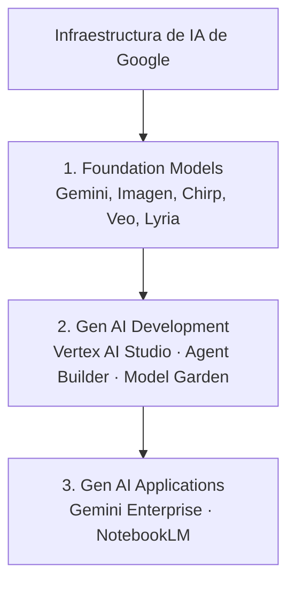

# Arquitectura de Generative AI en Google Cloud
> **Resumen en una frase**: Google organiza toda su oferta de Gen AI en **tres capas** —**modelos fundacionales**, **herramientas de desarrollo** y **aplicaciones**— construidas sobre su infraestructura de IA, de modo que tanto un desarrollador experto como un usuario de negocio sin conocimientos técnicos puedan generar contenido multimodal o incluso desplegar **agentes autónomos**.

## 1) Analogía sencilla (Feynman)
Piensa en la industria de la construcción:
- **Modelos fundacionales** = el **cemento, el acero y la maquinaria pesada** — materia prima potente pero genérica, producida a gran escala (Google la entrena e infraestructura).
- **Gen AI development** (Vertex AI Studio, Agent Builder, Model Garden) = la **constructora y sus arquitectos** — toman esa materia prima y la moldean en un diseño concreto: prototipan, ajustan (fine-tuning) y prueban.
- **Gen AI applications** (Gemini Enterprise, NotebookLM) = el **edificio ya habitable** — un usuario de negocio entra y usa el ascensor sin saber nada de estructuras ni concreto.

Cada capa depende de la de abajo, pero cada una también se puede consumir de forma independiente según qué tan "manos a la obra" quieras estar.

## 2) Mapa conceptual (Mermaid)

## 3) ¿Qué es Generative AI?
- Tipo de IA que **genera contenido** y **toma acciones** en nombre del usuario.
- Contenido **multimodal**: texto, código, imágenes, voz, video e incluso 3D.
- A partir de un **prompt** (pregunta o instrucción), Gen AI puede generar imágenes/video, resumir notas de reunión, crear reportes de investigación o construir chatbots de preguntas y respuestas.
- Más allá de generar contenido, mediante **agentes de IA** puede tomar **acción autónoma orientada a objetivos**: automatizar flujos de trabajo, planear y reservar viajes, agendar citas, asistir diagnósticos clínicos.

## 4) Breve historia de Google en GenAI
- **2017** — Introducción de **Transformer**, la arquitectura de red neuronal profunda que sustenta a *todas* las aplicaciones modernas de Gen AI.
- **2023** — Lanzamiento de **Gemini**, modelo multimodal que expande el concepto de AGI (Inteligencia Artificial General) gracias a su capacidad de procesar múltiples modalidades a la vez.
- **Últimos 18 meses** — aceleración fuerte: múltiples modelos fundacionales nuevos y aplicaciones prácticas como **NotebookLM** (investigar y analizar contenido con IA) y **Gemini Enterprise** (construir agentes de IA sin código).

## 5) Las tres capas en detalle
1. **Foundation models**: construidos sobre la infraestructura de IA de Google; son la "inteligencia" detrás de toda aplicación de Gen AI — entienden lenguaje, imágenes y video.
2. **Gen AI development**: herramientas como **Vertex AI Studio**, **Agent Builder** y **Model Garden** que permiten prototipar aplicaciones, desplegar agentes de IA y hacer fine-tuning de modelos. → ver [[vertex_ai_studio_idea_to_app]]
3. **Gen AI applications**: productos terminados como **Gemini Enterprise** y **NotebookLM**, que permiten a usuarios de negocio construir agentes de IA sin escribir código.

## 6) Relación con otras notas
- Los fundamentos de LLMs, alucinaciones y tipos de prompt ya se vieron en [[prompt_engineering_intro]] — esta nota los sitúa dentro de la arquitectura completa de Google.
- El detalle de la capa 2 (cómo se usa Vertex AI Studio en la práctica) está en [[vertex_ai_studio_idea_to_app]].
- Para comparar esta arquitectura con el stack equivalente de AWS (SageMaker, Bedrock) → [[gcp_vs_aws_homologacion]].

## 7) Preguntas Feynman (auto-chequeo)
1. ¿Por qué Transformer (2017) es una pieza histórica clave para *toda* la Gen AI actual, no solo para Google?
2. ¿Cuál es la diferencia entre que Gen AI "genere contenido" y que un agente de IA "tome acción"?
3. Explica con tus palabras qué hace cada una de las tres capas del stack de Google.
4. ¿Por qué Gemini (2023) se describe como un paso hacia AGI en vez de simplemente "otro LLM"?
5. Da un ejemplo de producto Google en cada una de las tres capas.

## 8) Tarjetas Anki
**Q:** ¿Cuáles son las tres capas del stack de Gen AI de Google?
**A:** Foundation models → Gen AI development → Gen AI applications.

**Q:** ¿Qué arquitectura de red neuronal (2017) sustenta a toda la Gen AI moderna?
**A:** Transformer.

**Q:** ¿Qué hace único a Gemini frente a modelos anteriores?
**A:** Es multimodal desde su diseño (texto, imagen, video) y avanza el concepto de AGI.

**Q:** Nombra dos herramientas de la capa "Gen AI development" de Google.
**A:** Vertex AI Studio y Agent Builder (también Model Garden).

**Q:** Nombra dos aplicaciones terminadas ("Gen AI applications") de Google.
**A:** Gemini Enterprise y NotebookLM.

## 9) Registro personal
- Es útil pensar el stack de Google como un embudo: entre más abajo (foundation models) más control técnico pero más esfuerzo; entre más arriba (apps) más rápido pero menos personalizable.
- Para mi objetivo de certificación ML Engineer, la capa que más me interesa dominar en profundidad es la 2 (Vertex AI Studio, Agent Builder, Model Garden, y luego Vertex AI Pipelines/MLOps), porque es donde vive el trabajo real de un ML engineer.
- Conexión con mi contexto laboral: en un sector regulado (SFC) la capa 3 (apps sin código tipo Gemini Enterprise) es tentadora para negocio, pero cualquier despliegue ahí requeriría primero pasar por gobierno de datos y validación de cumplimiento — no es "plug and play" en banca/pensiones.
