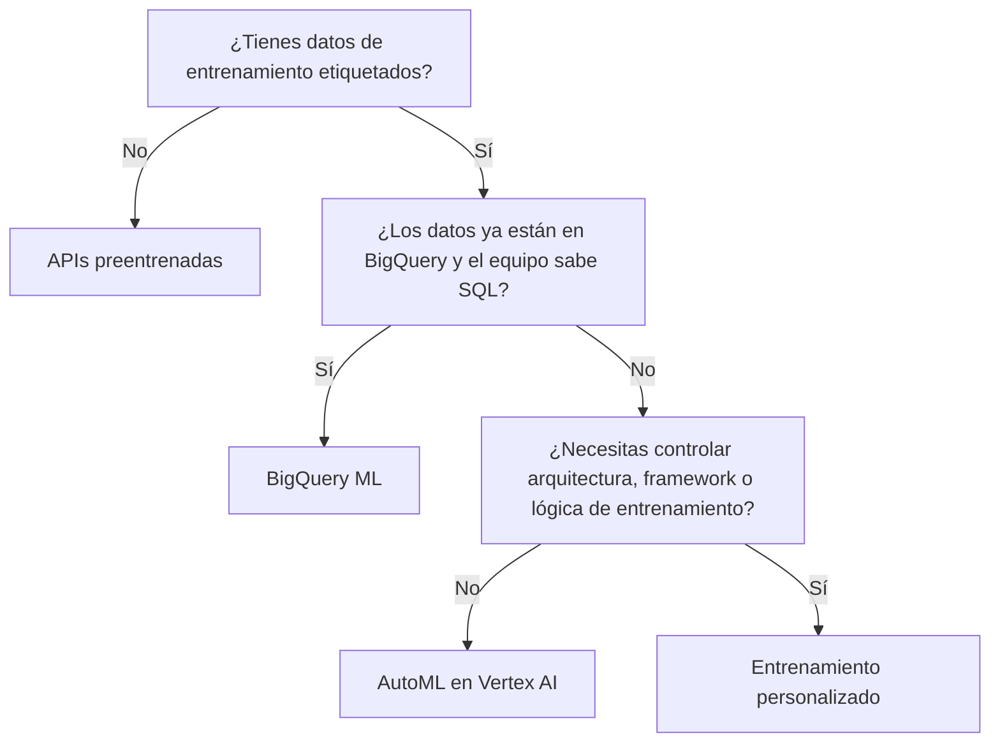

# Opciones de desarrollo de ML en Google Cloud
> **Resumen en una frase**: Para construir IA **predictiva** (clasificación, regresión, previsión) Google Cloud ofrece cuatro caminos que van de menos a más control —**APIs preentrenadas → BigQuery ML → AutoML → entrenamiento personalizado**— y la elección no depende de cuál es "mejor", sino de tres variables: **cuántos datos etiquetados tienes**, **qué experiencia en ML hay en el equipo** y **cuánto control necesitas sobre la arquitectura**.

## 1) Analogía sencilla (Feynman): cómo conseguir la cena

- **APIs preentrenadas** = **pedir a domicilio**. No cocinas, no compras ingredientes, no tienes cocina. Eliges del menú y llega. Rapidísimo, cero esfuerzo, pero comes lo que el restaurante ofrece.
- **BigQuery ML** = **cocinar con lo que ya tienes en la nevera**, sin sacar nada de la casa. Tus datos ya viven en BigQuery; preparas el modelo ahí mismo con el utensilio que ya sabes usar (SQL).
- **AutoML** = un **robot de cocina de gama alta**. Le pones los ingredientes (tus datos) y él decide temperatura, tiempo y técnica. Tú te concentras en *qué* plato quieres, no en *cómo* se cocina.
- **Entrenamiento personalizado** = **cocinar desde cero**, tú eliges el cuchillo, la sartén y cada paso. Máximo control y máximo esfuerzo; es lo único que sirve si el plato no está en ningún menú ni recetario.

Ninguna es superior: nadie monta una cocina profesional para calentar una sopa, y nadie pide a domicilio cuando el plato es su receta secreta.

## 2) El entorno: Vertex AI como plataforma unificada

Antes de elegir la opción, hay que entender **dónde** se trabaja. Vertex AI es la respuesta de Google a dos problemas históricos:

- **Producción**: escalabilidad, supervisión, integración, entrenamiento y entrega continuos. Google cita a Gartner en que solo **la mitad** de los proyectos de ML empresarial superan la fase piloto.
- **Facilidad de uso**: sin un flujo unificado, el científico de datos gasta su tiempo buscando herramientas en vez de configurando el modelo.

"Unificada" significa dos cosas concretas:

1. **Cubre la canalización completa de ML**: preparar datos (desde Cloud Storage, BigQuery o máquina local) → ingeniería de atributos (compartibles vía **Feature Store**) → entrenamiento y ajuste de hiperparámetros → despliegue y supervisión.
2. **Cubre IA generativa y predictiva** en el mismo lugar: Vertex AI Studio y Agent Builder por el lado generativo (ver [[genai_arquitectura_google_cloud]]), AutoML y entrenamiento personalizado por el predictivo.

Google resume su valor en cuatro puntos: experiencia **fluida** de extremo a extremo, **escalable** vía MLOps, **sustentable** por reutilización de atributos y artefactos, y **rápida** — afirma un 80 % menos líneas de código que los competidores (dato de marketing de Google, no verificado de forma independiente).

## 3) Tabla comparativa — el corazón de esta nota

| Dimensión | APIs preentrenadas | BigQuery ML | AutoML | Entrenamiento personalizado |
|---|---|---|---|---|
| **Tipos de datos** | Tabular, imagen, texto, video **y audio** | Tabular y semiestructurado (JSON) | Tabular e imagen (ver §7) | Tabular, imagen, texto, video |
| **Datos de entrenamiento** | **Ninguno** | Muchos | Medios | Muchos |
| **Experiencia en ML** | Mínima | Mínima, pero **exige SQL** | Baja | **Alta** |
| **Experiencia en programación** | Baja (llamada a API) | SQL | Ninguna (apuntar y hacer clic) | **Alta** |
| **Ajuste de hiperparámetros** | ❌ No disponible | ✅ Sí | ❌ No disponible | ✅ Sí |
| **Tiempo de entrenamiento** | **Ninguno** (modelo ya entrenado) | Depende del proyecto | Depende del proyecto | **El más largo** (parte de cero) |
| **Nivel de control** | Mínimo | Medio | Bajo | **Total** |

### Mapa de decisión



Las señales que deciden, en una línea cada una:

- **Sin datos de entrenamiento y tarea perceptiva común** (visión, video, lenguaje natural) → **APIs preentrenadas**.
- **Datos ya en BigQuery + equipo que sabe SQL** → **BigQuery ML**, con modelos predefinidos invocados desde consultas.
- **Datos propios, poco tiempo de programación, foco en el problema de negocio** → **AutoML**.
- **Control del flujo, del framework y de la arquitectura** → **entrenamiento personalizado** en Vertex AI Workbench o Colab Enterprise.

## 4) APIs preentrenadas — la vía sin datos

Una API define cómo se comunican dos componentes de software. La analogía del curso: **son como los tomacorrientes**. En EE. UU. son tipo A y B, en Europa tipo F; como viajero solo necesitas saber qué adaptador usar, sin saber nada de cómo está construida la red eléctrica detrás del muro. Igual con una API: sabes qué llamar, qué parámetros pasar y en qué formato, sin preocuparte por el entrenamiento ni el despliegue del modelo.

El patrón de uso es idéntico a llamar una función:

```python
import google.generativeai as genai

genai.configure(api_key="YOUR_API_KEY")                    # 1. autenticar
model = genai.GenerativeModel("gemini-2.5-flash")          # 2. elegir modelo
response = model.generate_content(                          # 3. enviar el prompt
    "¿Cuáles son los tres países más grandes por superficie?"
)
print(response.text)                                        # 4. leer la respuesta
```

Familias de APIs que ofrece Google Cloud: **IA generativa** (modelos fundacionales como Gemini, más Vertex AI Agent Builder), **ML** (Vertex AI para entrenar, supervisar y ajustar con esfuerzo mínimo), y las de **voz, imágenes, documentos y conversación**. La lista cambia seguido, y muchas se están absorbiendo en las **APIs de Gemini**, que son multitarea y multimodales. El ejercicio práctico de esta familia está en [[natural_language_api]].

## 5) AutoML — automatizar el oficio, no solo el entrenamiento

AutoML (*Automated Machine Learning*) se anunció en enero de 2018 y desde 2021 está **integrado dentro de Vertex AI**. Automatiza cuatro cosas que normalmente consumen semanas: ingeniería de atributos, búsqueda de arquitectura, ajuste de hiperparámetros y ensamblado de modelos.

Funciona en cuatro fases:

1. **Procesamiento de datos** — convierte automáticamente números, fechas, texto, categorías, arrays de categorías y campos anidados al formato que el modelo necesita.
2. **Búsqueda de modelo y ajuste**, con dos tecnologías:
   - **Neural Architecture Search (NAS)**: prueba distintas arquitecturas y compara su rendimiento para encontrar la óptima.
   - **Aprendizaje por transferencia**: parte de modelos ya entrenados con enormes volúmenes de datos en vez de empezar de cero. Es lo que permite **buenos resultados con conjuntos pequeños y menos cómputo** — el mismo principio detrás de los LLM de propósito general que luego se ajustan a un dominio.
3. **Ensamblado** — reúne los mejores modelos de la fase 2. El número depende del presupuesto de entrenamiento, típicamente **~10**; la agregación puede ser tan simple como promediar sus predicciones.
4. **Predicción** — el ensamble sirve las predicciones. Usar varios modelos en vez de uno mejora la exactitud de forma significativa.

## 6) Entrenamiento personalizado — el enfoque "hazlo tú mismo"

Se justifica cuando lo que necesitas **excede lo que AutoML puede hacer** y el control total sobre arquitectura, frameworks y lógica de entrenamiento se vuelve esencial.

**Primera decisión: el entorno de ejecución.** Otra analogía de cocina:

| Opción | Analogía | Cuándo usarla |
|---|---|---|
| **Contenedor precompilado** | Cocina ya equipada con alacenas, electrodomésticos y utensilios | Tu entrenamiento usa Python, TensorFlow o PyTorch y no te importa la infraestructura subyacente |
| **Contenedor personalizado** | Habitación vacía que amueblas tú | Necesitas definir entorno, tipo de máquina y discos |

**Segunda decisión: la herramienta.** **Vertex AI Workbench** (un Jupyter desplegado que cubre exploración → entrenamiento → despliegue, y desde el que se puede escribir SQL para conectar BigQuery con Vertex AI sin fricción) o **Colab Enterprise**, integrado en Vertex AI desde 2023.

**Tercera decisión: la biblioteca.** TensorFlow, scikit-learn, PyTorch o JAX. TensorFlow se organiza en capas de abstracción, y vale la pena tener clara la jerarquía porque es examinable:

| Capa | Qué contiene |
|---|---|
| **APIs de alto nivel** (Keras) | Ocultan la construcción y el bucle de entrenamiento. Es donde se trabaja normalmente |
| **Bibliotecas de modelos** | Capas de redes neuronales, métricas de evaluación |
| **APIs de bajo nivel** | Operaciones en C++ y funciones numéricas llamables desde Python |
| **Hardware** | CPU, GPU y TPU |

Vertex AI aloja TensorFlow **completo** —bajo y alto nivel— como servicio administrado, sin importar en qué capa escribas.

El flujo canónico con `tf.keras` son tres pasos: **crear** el modelo (ensamblar capas con `Sequential`), **compilar** (especificar función de pérdida y optimizador — aquí viven los hiperparámetros) y **entrenar** con `fit` (datos de entrada, salidas esperadas, número de épocas).

**JAX** aparece como la alternativa emergente de Google: biblioteca de cómputo numérico de alto rendimiento, flexible, orientada tanto a investigación como a producción.

## 7) Advertencia sobre los tipos de datos de AutoML

La transcripción del curso afirma que **AutoML admite solo datos tabulares y de imagen**. La documentación oficial de Vertex AI sigue listando también texto y video para AutoML, así que **la contradicción no quedó resuelta** al escribir esta nota.

La lectura más probable es que Google esté migrando los casos de texto y video de AutoML hacia el ajuste de modelos **Gemini**, y que el material del curso ya refleje ese estado mientras la documentación arrastra ambas versiones. Para el examen, **la guía oficial vigente manda**; conviene reverificar este punto antes de darlo por cierto. Por eso ninguna tarjeta Anki de esta nota afirma una lista exacta de tipos de datos para AutoML.

## 8) Relación con otras notas

- La capa generativa de este mismo stack está en [[genai_arquitectura_google_cloud]]; esta nota cubre la **predictiva**.
- El ciclo completo de personalización de modelos generativos (prompt design → tuning) está en [[vertex_ai_studio_despliegue_y_tuning]]. Ojo con la simetría: allá el eje es *cuánto cambias un modelo fundacional*; aquí es *cuánto construyes tú desde cero*.
- El ejercicio práctico con una API preentrenada está en [[natural_language_api]].
- El criterio de elección funciona igual que en [[comparativa_storage_gcp]]: se gana **descartando** con el requisito duro del escenario, no eligiendo por atributos genéricos.

## 9) Preguntas Feynman (auto-chequeo)

1. Sin mirar la tabla, nombra las cuatro opciones ordenadas de menor a mayor control sobre el modelo.
2. ¿Cuáles son las **dos** opciones que permiten ajustar hiperparámetros, y por qué justamente esas dos?
3. Un equipo tiene 5 años de datos transaccionales ya en BigQuery, sabe SQL y no tiene ingenieros de ML. ¿Qué eliges y qué descartas primero?
4. Explica por qué el aprendizaje por transferencia es lo que hace viable a AutoML con conjuntos de datos pequeños.
5. ¿Cuándo elegirías un contenedor personalizado en vez de uno precompilado?
6. ¿Qué ganas al ensamblar ~10 modelos en vez de servir el mejor?

## 10) Tarjetas Anki

**Q:** ¿Cuáles son las cuatro opciones de desarrollo de ML en Google Cloud, de menor a mayor control?
**A:** APIs preentrenadas → BigQuery ML → AutoML → entrenamiento personalizado.

**Q:** ¿Qué opciones de ML en GCP permiten ajustar hiperparámetros?
**A:** Solo **BigQuery ML** y el **entrenamiento personalizado**. Las APIs preentrenadas y AutoML no lo permiten.

**Q:** ¿Sin datos de entrenamiento, y la tarea es visión, video o lenguaje natural?
**A:** **APIs preentrenadas** — son las únicas que no requieren datos de entrenamiento ni tiempo de entrenamiento.

**Q:** ¿Los datos ya están en BigQuery y el equipo sabe SQL pero no ML?
**A:** **BigQuery ML** — modelos predefinidos invocados desde consultas SQL, sin sacar los datos del warehouse.

**Q:** ¿Datos propios, poco tiempo de programación y foco en el problema de negocio, no en la arquitectura?
**A:** **AutoML** en Vertex AI (solución sin código, de apuntar y hacer clic).

**Q:** ¿Se necesita controlar arquitectura, framework y lógica de entrenamiento?
**A:** **Entrenamiento personalizado**, en Vertex AI Workbench o Colab Enterprise.

**Q:** ¿Qué distingue a AutoML del entrenamiento personalizado?
**A:** AutoML automatiza arquitectura e hiperparámetros y no deja tocarlos; el entrenamiento personalizado da control total pero exige experiencia en ML y el mayor tiempo de entrenamiento.

**Q:** ¿Qué dos tecnologías usa AutoML para buscar el mejor modelo?
**A:** **Neural Architecture Search** (prueba y compara arquitecturas) y **aprendizaje por transferencia** (parte de modelos ya entrenados).

**Q:** ¿Cuántos modelos ensambla típicamente AutoML y para qué?
**A:** Unos **10** (depende del presupuesto de entrenamiento); ensamblar mejora la exactitud frente a servir un solo modelo.

**Q:** En entrenamiento personalizado, ¿cuándo usas un contenedor personalizado en vez de uno precompilado?
**A:** Cuando necesitas definir el entorno, el tipo de máquina y los discos. El precompilado basta si usas Python/TensorFlow/PyTorch y la infraestructura te da igual.

**Q:** ¿Qué API de alto nivel de TensorFlow oculta la construcción del modelo y el bucle de entrenamiento?
**A:** **Keras** (`tf.keras`), en la capa más alta sobre bibliotecas de modelos, APIs de bajo nivel y hardware.

**Q:** ¿Cuáles son los tres pasos canónicos de `tf.keras` para construir un modelo?
**A:** **Crear** (ensamblar capas), **compilar** (pérdida y optimizador) y **entrenar** (`fit`, con épocas).

## 11) Glosario

- **AutoML**: automatización de ingeniería de atributos, búsqueda de arquitectura, ajuste de hiperparámetros y ensamblado.
- **NAS (Neural Architecture Search)**: búsqueda automática de la arquitectura de red óptima entre muchas candidatas.
- **Aprendizaje por transferencia**: reutilizar un modelo preentrenado como base para una tarea nueva con menos datos.
- **Feature Store**: repositorio de Vertex AI para crear, compartir y reutilizar atributos.
- **Contenedor precompilado / personalizado**: entorno de ejecución del código de entrenamiento, ya equipado o definido por ti.
- **Vertex AI Workbench**: entorno tipo Jupyter administrado que cubre exploración, entrenamiento y despliegue.
- **JAX**: biblioteca de cómputo numérico de Google, alternativa emergente a TensorFlow.

## 12) Registro personal

- Esta tabla es el mapa que me faltaba: yo venía de un mundo donde "hacer ML" significaba siempre entrenamiento personalizado, y en GCP eso es solo **una de cuatro** opciones. La pregunta útil ya no es "¿qué modelo entreno?" sino "¿de verdad necesito entrenar algo?".
- El paralelo con [[comparativa_storage_gcp]] es incómodo pero útil: allí fallé por justificar con atributos genéricos en vez de descartar con el requisito duro. Aquí el requisito duro es **¿tengo datos etiquetados?** y **¿necesito tocar la arquitectura?** — dos preguntas, y con ellas se descartan tres de las cuatro opciones casi siempre.
- Conexión con mi contexto: en una entidad vigilada por la SFC, la opción "sin código" es tentadora para negocio pero traslada el problema de gobierno, no lo elimina. Con AutoML o con APIs preentrenadas no puedo explicar la arquitectura del modelo, y eso choca con requisitos de explicabilidad y trazabilidad para decisiones que afecten a un afiliado. Para modelos con impacto directo sobre clientes, el entrenamiento personalizado no es solo preferencia técnica: puede ser un requisito de cumplimiento. Esto es orientativo y habría que validarlo con las áreas jurídica y de cumplimiento.
- Pendiente: reverificar los tipos de datos de AutoML (§7) contra la guía oficial del examen antes de fijar ese dato.
