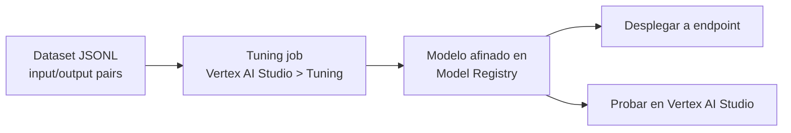

# Vertex AI Studio: despliegue, grounding/RAG y tuning de modelos
> **Resumen en una frase**: Tras diseñar y evaluar un prompt, la segunda mitad del ciclo prompt-to-producción cubre **cómo llevarlo a una aplicación** (UI, SDK, API), **cómo mantenerlo veraz y actualizado** (grounding/RAG) y **cómo personalizar el modelo mismo** cuando el prompt ya no basta (prompt design → parameter-efficient tuning → full fine-tuning).

## 1) Analogía sencilla (Feynman): la educación de un profesional
Piensa en un médico:
- **Foundation model** = su educación básica (K-12): conocimiento general, amplio, no especializado.
- **Full fine-tuning** = hacer una **especialización médica completa**: reestructura a fondo su conocimiento interno para un dominio específico (cirugía, oncología); toma tiempo y recursos, pero el resultado domina tareas complejas del dominio.
- **Parameter-efficient tuning (adapter tuning)** = un **diplomado o curso corto de actualización**: ajusta solo una porción puntual de su conocimiento, más rápido y barato que rehacer la carrera completa.
- **Grounding / RAG** = el hábito continuo de **consultar las guías clínicas y estudios más recientes** antes de dar un diagnóstico: el médico no cambió su formación, pero verifica su respuesta contra la fuente de verdad más actual.

Es decir: el *tuning* cambia lo que el modelo **sabe internamente**; el *grounding* cambia contra **qué información externa verifica** lo que dice, sin tocar sus parámetros.

## 2) Opciones de despliegue: de la idea al código
Más allá de construir el prompt en la interfaz (UI) de Vertex AI Studio — la vía sin código — existen dos rutas de bajo código para integrar el prompt en una aplicación propia:

| Vía | Qué es | Cuándo usarla |
|---|---|---|
| **UI (Vertex AI Studio)** | Explorar y probar prompts interactivamente, sin código | Prototipado rápido, evaluación manual |
| **SDK (Python)** | El botón **"Build with Code"** genera el código del prompt y sus parámetros listo para pegar en un script Python | Integrar el prompt en un pipeline o aplicación existente |
| **API (cURL)** | Mismo prompt expuesto como llamada HTTP | Integrar desde cualquier lenguaje o servicio externo |

Para producción, Vertex AI Studio se integra con **Cloud Run** y **Cloud Shell**, de modo que no hay que preocuparse por aprovisionar la infraestructura subyacente — el mismo patrón *serverless* que ya se vio en [[cloud_run_intro]].

## 3) Grounding y RAG: el qué y el cómo
Los modelos de Gen AI son **preentrenados**: sus respuestas dependen de datos de entrenamiento que pueden estar desactualizados o ser imprecisos para un dominio específico.

- **Grounding** es el **qué**: la práctica de conectar el modelo a fuentes de datos externas y confiables para verificar sus respuestas contra información real y vigente.
- **RAG (Retrieval Augmented Generation)** es el **cómo**: un método concreto para implementar grounding — el modelo primero **recupera (retrieve)** información relevante de una fuente externa y luego la usa para **generar** la respuesta.

Desde Vertex AI Studio, un prompt se puede fundamentar (*ground*) de dos formas:
1. **Búsqueda en tiempo real de Google** — para información general y actualizada.
2. **Datos propios** — para instruir al modelo con conocimiento específico de un dominio o empresa.

## 4) Tuning: personalizar el modelo cuando el prompt no basta
El *prompt design* que ya vimos en [[vertex_ai_studio_parametros_modelo]] **no altera los parámetros del modelo** — solo lo guía con instrucciones y ejemplos. Cuando eso no es suficiente para tareas complejas, existen métodos que sí modifican el modelo:

| Método | Qué actualiza | Costo computacional | Cuándo usarlo |
|---|---|---|---|
| **Prompt design** | Nada (0 parámetros) | Mínimo | Experimentación rápida, no requiere conocimiento de ML |
| **Parameter-efficient tuning** (*adapter tuning*) | Un subconjunto pequeño de parámetros | Medio | Adaptar un modelo grande a una tarea/dominio específico sin reentrenarlo por completo |
| **Full fine-tuning** | Todos los parámetros del modelo | Alto (tuning y serving) | Tareas altamente complejas donde se necesita la mayor calidad posible |

Vertex AI actualmente da soporte a **supervised fine-tuning** (una forma de personalización) para las técnicas anteriores:
- Enseña al modelo una **habilidad nueva** usando cientos de ejemplos etiquetados que demuestran el comportamiento deseado.
- Es una buena opción para tareas bien definidas con datos etiquetados disponibles: clasificación, resumen, extracción, chat.
- El resultado del *tuning job* es un **modelo nuevo** que combina los parámetros recién aprendidos con el modelo original.

### Flujo práctico en Vertex AI Studio

1. Desde el menú **Tuning → Create a Tuned Model**, se especifican el modelo base y el dataset de tuning.
2. El dataset debe estar en formato **JSONL**, donde cada registro es un par: *input text* (el prompt) y *output text* (la respuesta esperada). Ejemplo: el prompt *"This commercial building is architecturally interesting..."* con la etiqueta esperada *"positive"*.
3. Al completarse el job, el modelo afinado queda disponible en el **Model Registry**, listo para desplegarse a un endpoint o probarse directamente en el Studio.

## 5) Relación con otras notas
- Esta nota cierra el ciclo *prompt-to-production* iniciado en [[vertex_ai_studio_idea_to_app]] (diseño) y continuado en [[vertex_ai_studio_parametros_modelo]] (parámetros y evaluación): diseñar → evaluar → **construir, fundamentar y afinar**.
- El *fine-tuning* aquí descrito es la práctica concreta de la capa "Gen AI development" mencionada en [[genai_arquitectura_google_cloud]].
- El patrón *dataset → job → registry → endpoint* es el mismo patrón general de MLOps que ya conozco de otras herramientas (Vertex AI Pipelines, MLflow) — aquí aplicado específicamente a modelos fundacionales en vez de modelos entrenados desde cero.

## 6) Preguntas Feynman (auto-chequeo)
1. ¿Cuál es la diferencia entre grounding y RAG — cuál es el "qué" y cuál el "cómo"?
2. ¿Por qué el *prompt design* no se considera una forma de *tuning* en sentido estricto?
3. Con la analogía del médico, ¿en qué se diferencia el *full fine-tuning* del *parameter-efficient tuning*?
4. ¿Qué formato de datos necesita un *supervised fine-tuning job* en Vertex AI y qué contiene cada registro?
5. Si necesitas integrar un prompt ya probado en una aplicación externa que no es Google Cloud, ¿qué vía de despliegue usarías y por qué?
6. ¿Qué pasa con un modelo justo después de que termina un *tuning job* exitoso, antes de desplegarlo?

## 7) Tarjetas Anki
**Q:** ¿Qué es grounding?
**A:** Conectar el modelo a fuentes de datos externas confiables para verificar sus respuestas contra información actualizada.

**Q:** ¿Qué es RAG?
**A:** Retrieval Augmented Generation — un método para implementar grounding: primero recupera información relevante, luego la usa para generar la respuesta.

**Q:** ¿Cuáles son las tres formas de personalizar un modelo, en orden de menor a mayor costo computacional?
**A:** Prompt design → parameter-efficient tuning (adapter tuning) → full fine-tuning.

**Q:** ¿Qué tipo de fine-tuning soporta actualmente Vertex AI?
**A:** Supervised fine-tuning.

**Q:** ¿En qué formato debe estar el dataset de un tuning job y qué contiene cada registro?
**A:** JSONL; cada registro es un par input text (prompt) / output text (respuesta esperada).

**Q:** ¿Dónde queda un modelo después de un tuning job exitoso, antes de desplegarlo?
**A:** En el Vertex AI Model Registry.

**Q:** Nombra las dos vías de bajo código para desplegar un prompt más allá de la UI.
**A:** SDK en Python y API con cURL (código generado con "Build with Code"), con Cloud Run/Cloud Shell para producción.

**Q:** ¿Conocimiento factual que cambia varias veces al año y hay que citar la fuente?
**A:** **Grounding implementado con RAG**, no tuning. El tuning cambia lo que el modelo sabe internamente; no inyecta hechos cambiantes ni da trazabilidad a la fuente citada.

## 8) Glosario
- **Grounding**: práctica de verificar las respuestas de un modelo contra fuentes de datos externas y confiables.
- **RAG (Retrieval Augmented Generation)**: método que implementa grounding recuperando información relevante antes de generar la respuesta.
- **Parameter-efficient tuning / adapter tuning**: ajuste de un subconjunto pequeño de los parámetros de un modelo grande para adaptarlo a una tarea específica.
- **Full fine-tuning**: reentrenamiento que actualiza todos los parámetros del modelo; mayor calidad, mayor costo.
- **JSONL**: formato de archivo con un objeto JSON por línea; usado por Vertex AI para datasets de tuning.
- **Model Registry**: catálogo de Vertex AI donde quedan versionados los modelos (base o afinados) listos para desplegar.

## 9) Registro personal
- La distinción grounding (qué) vs. RAG (cómo) es la que más me costaba tener clara — la analogía del médico consultando guías clínicas me sirve para no confundirla con fine-tuning nunca más.
- El flujo dataset → tuning job → Model Registry → endpoint es prácticamente idéntico al patrón que ya manejo con MLflow/Vertex AI Pipelines para modelos entrenados desde cero; lo nuevo aquí es aplicarlo sobre un modelo fundacional ya preentrenado.
- Conexión con mi contexto profesional: en un entorno regulado por la SFC, si en algún momento usamos **grounding con datos propios** (información interna de clientes o productos) para un caso de uso de Gen AI, eso implica las mismas preguntas de gobierno de datos que cualquier otra fuente que alimente un modelo — quién autoriza qué datos se exponen al modelo y cómo se audita esa trazabilidad. Vale la pena anticiparlo antes de que negocio lo pida como algo "simple". Esta reflexión es orientativa; cualquier decisión real debe validarse con el área jurídica/cumplimiento de Protección.
